<link rel="stylesheet" type="text/css" href="styles.css">

## GAME №2  
Ray Garrison vs Beginner_2017  
littlegolem.net  
Tournament: draughts.cv.DAMEO.5.1.1  
2018  
  
Sometimes I come across games that are impossible to analyse because of Dameo's infinity. Yes, sure, I can dive deep enough, but the abundance of variants and continuations discourages me.  

Now I'm going to tell you about one such game. It will be a long story, but I'd like the reader to fully feel that an ordinary 8x8 board can be like a cosmos with infinite stars.  

My meetings at the board with Ray Garrison are often of a memorable character. Ray is a very pleasant partner and conversationalist; he reads a lot and has a deep knowledge. Although I don't know him personally, but only by correspondence, I have a strong feeling that I am talking to a gentleman from the 19th century - well-mannered, tactful and friendly.  

One of our first fights took place in 2018. I had known Dameo for less than a year and tried to experiment a lot. I was still a ‘raw’ player, without style or understanding, but with a huge desire and energy. Having watched a few of Ray's games before this game, I realised that he is a classical style player, preferring reliable structures with traps a1-c1 and h1-f1 against the opponent's king.  
So, I decided to challenge such a strategy…

**1.g1-h2	e7-e5**  
**2.e1-g3	d7-d5**  
**3.b1-a2	g8-h7**  
**4.d2-d4	d8-b6**  
**5.c2-c4	...**

Diagr. 1
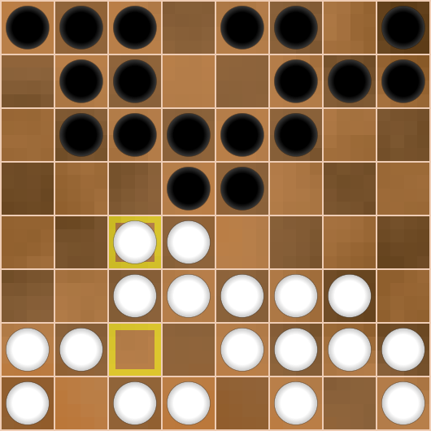

I won't dwell on the first moves, as they can be almost any. The main thing is the future plan.
It was at this point that I decided to take a radical step to try to throw my opponent off his equilibrium by any means.  

**5...    c8a6?!**  
**6. d1g4	f8h6?!**

Diagr. 2
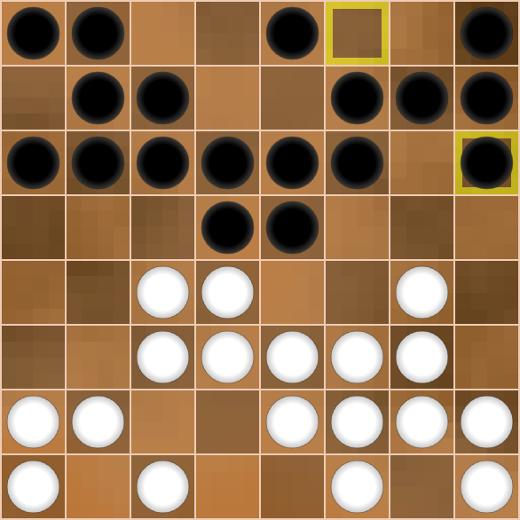

How to comment on these moves by Black? Any slightly experienced player will see the obvious disadvantages and criticise it. Indeed, Black is exposing its rear and burning all bridges. Once White gets a king, it will be impossible to catch it on the 8th row.  

However, such a development has a plus: Black has extra checkers in the struggle along the entire clash line. I expected to suppress White by the number of my checkers and supposed that this pressure will compensate for all the disadvantages of my decision. For example, Black already has a 5 vs. 3 advantage on verticals ‘a’ and ‘b’.  

This plan, but only in a less radical form, I sometimes apply it now.

**7.a2b3?	b8a7**

The move a2b3 seemed a bit strange to me. On the contrary, playing for White, I would try to block the vertical ‘a’ by e2b5! and c4:a4. But White loses its sense of danger, allowing Black to create an attack on the flank.

**8.h2f4	...** (with the idea of f3f5)  
**8...		e8g6**

Diagr. 3
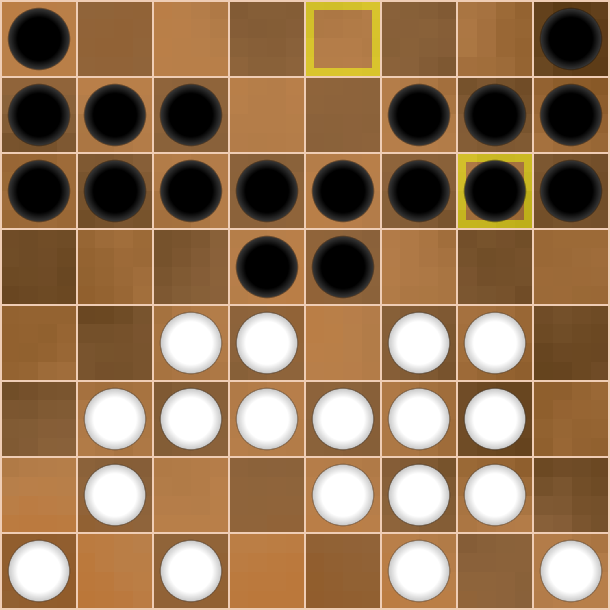

Picture position!
Black managed to get an advantage on the flanks, and its square d6-e6-e5-d5 holds the defence in the centre.

**9.e2e4	  a8a5**  
**10.b2a3	  a5a4**  
**11.a3:a5  a6:a4**  
**12.c3b4!?  ...**

Diagr. 4
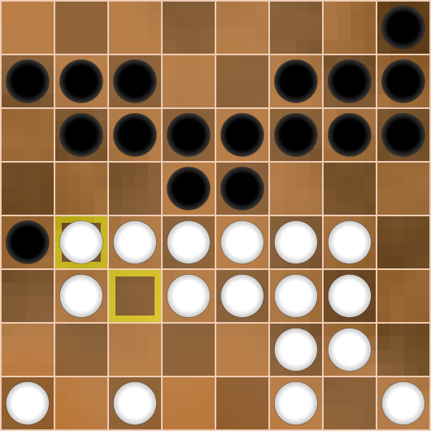

Black consistently carries out its plan and the flank attack already looks threatening. Indeed, Black has an advantage in strength (6 vs. 5), as well as freedom for manoeuvres and accumulation of forces. White is constrained and clamped.  

Realising that passive defence is unlikely to be successful, Ray resorts to a desperate measure, risking to lose immediately, but builds a trap...

**12...		c7c5?**

It was played with the wrong piece! Believing that the position is won almost automatically by attacking the checker c4, I played the checker c7. I remember that I was afraid of some penetration on a6 and left my checker on a7.  

But who would have thought that it needed to protect not the a6 field, but the d7!
My move looks very strong, but Ray blasts the position with a landmine hidden in the depths of the board!

**13.d3b5!!	...**

Oh, my God! What is that?  

**13...		  с5:a3**  
**14.f3f5!  ...**

Where's that coming from? What's happening? I remember sitting there like I was knocked out and didn't understand anything.

**14...  		d5:h3**
**15.f5:d7  ...**

What's the matter?! With a checker on c7, White's combination would not work!

**15...  		a4:c4**  
**16.d7c8	  b6:b4**  
**17.c8:c2	...**

Diagr. 5
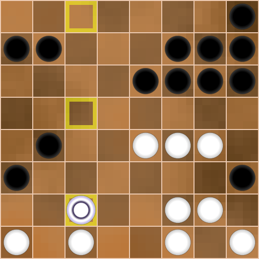

Well, an anomalous position has emerged on the board, where Black has four checkers for a king, and also the dangerous checkers a3 and h3. The problem is that White's king is so strong that it doesn't let Black's pieces even move because of constant hits with free tempo. For example, Black attacks a checker, and White sacrifices it on the next move, and in the meantime moves the king to the necessary place. Black is forced to capture the prey, and White's king destroys a large enemy force.  

Now threatens g4g5, so the obvious countermeasure seems to be the move g7g5. Really, Black with a tempo attacks white pieces and at the same time threatens to catch the king by b7c6. What else can be demanded from such a strong at first glance solution?  

I noticed a long time ago that in abnormal positions simple logical moves do not lead to the goal, because these kinds of positions require abnormal decisions. :)

It would seem that the most obvious move g7g5, which 95% of players would make, is the best solution, but alas, White has an impressive counter-punch from which goosebumps run down my skin.

So, let's consider:

*17...		  g7g5*  
*18.g2g3!!	h3:f5*

Diagr. 6
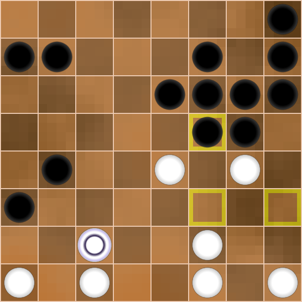

Here is the free tempo, which the white king has been waiting for! However, if we immediately play next

*19.c2a2?   g5:g3*  
*20.a2:e5	  ...*

the white king will destroy 5 black pieces and will be forced to stop on the field e5, as it is impossible to jump the f5 piece twice. But in this case Black catches the king by f6g5! See here:

*20...      g3h2!*  
*21.h1:h3   f6g5*  
*22.e5:h5   h6:h2*

Diagr. 7
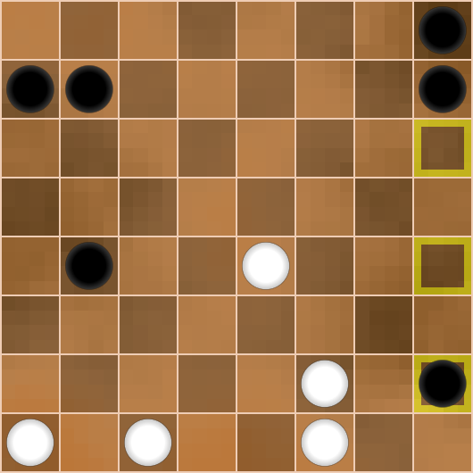

Thanks to the active checkers h2 and b4, Black gets the king first and must win.

Let's go back to the diagram 6. 

As you can see, checker e4 hinders the white king, limiting its mobility. For this reason White should not hurry to use the free tempo, but make an incredible move…

*19.e4e5!!	...*

Diagr. 8
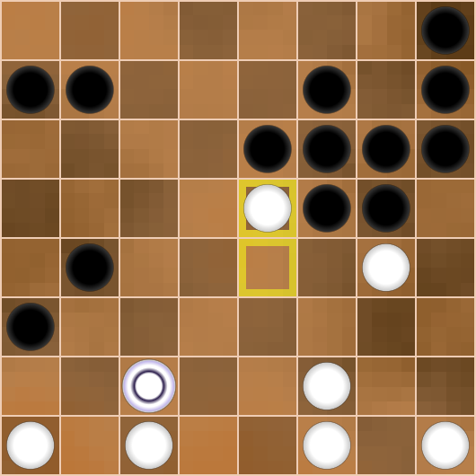

The most amazing thing is that I found this move while playing the game, mulling over the position in my mind! I remember it was on my lunch break at work. I didn't think any more, because White's king gets the greatest opportunities, and I intuitively felt that Black would be bad.  

Next, we'll look at all 3 captures.

Continuation 1.

*19...		  g5:g3*  
*20.e5:e5		...*

Diagr. 9

Playing black checkers and defending such a position is a below average pleasure. Even if analytically it will be proved that Black saves, then most likely it is possible by the only correct moves. The prospect of finding a chain of the best 10-15 moves in a row, when you can't make a single mistake, instantly breaks the will of 95% of players. And only 5% are able to balance over the precipice, like the ship captains of past centuries who were caught in the terrible storms at Cape Horn, but still overcame the challenge.  
Let's imagine that you play black and try to overcome all the obstacles on the way to salvation.

Black has 2 methods of defence: passive and active.   
a) The passive method consists in catching the white king by sacrificing several checkers:

*20...		  g3h2!*  
*21.h1:h3	  b4c3*  
*22.c2:g6	  h6:f6*	

Diagr. 10
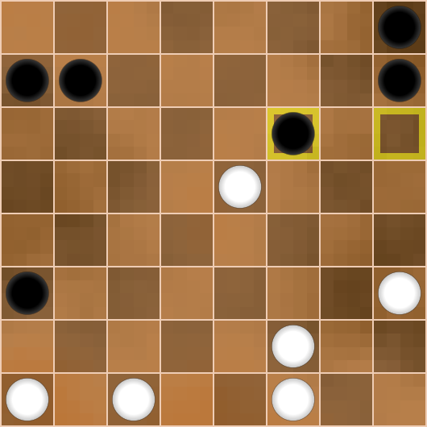

So, material equality is restored, but the powerful checker e5 gives White a strong initiative. Since Black threatens to invade the field b2, White has no time to invade e5d6 and has to spend one tempo on defence.  

*23.a1b2		b7c6*  
*24.f1f3		h8h6*  
*26.f2f4		h7h5*

Diagr. 11
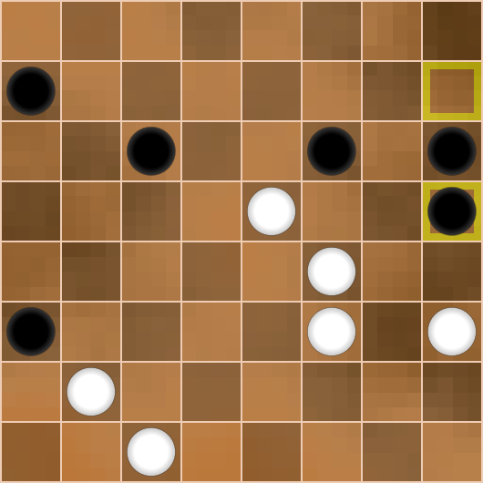

Black responds to White's attack on the vertical line ‘f’ with a counterattack on the line ‘h’!  

*27.f3f5		h6h4*  
*28.f5:f7		h4:h2*	  
*29.f7g8!		...*  

Diagr. 12
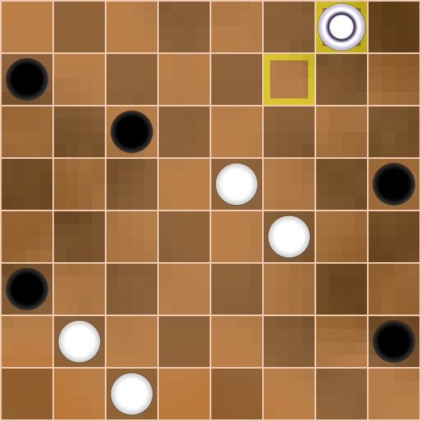

So, Black also gets a king by attacking all white checkers at the same time. But it turns out that the move

*29...	    h2h1/h2g1??*  

instantly loses the game after a surprising answer  

*30.g8a2!!	h1:f3*  
*31.a2:b3, 2:0!*  

This example clearly shows that the mobility of the king can be a terrible strength (like the white king) as well as a weakness (like the black king).

To escape, Black had to anticipate this trap!
A tentative sacrifice leads to a probable draw

*29...		  c6d5!*  
*30.e5:c5		h2h1*  
*31.g8h8		h1:f3*  
*32.h8:c3		...*  

Diagr. 13
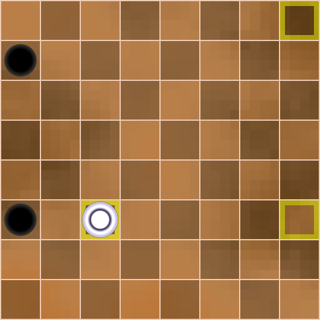

The white king constantly attacks both black pieces, which are placed too far from each other and cannot interact. One of the black pieces dies, draw.   
Convince yourself of it.

So, the passive method of defence allows Black to achieve a draw with difficulty. However, analysis after the game is not the same as direct play at the board! 

Let's go back to diagram #9 and consider  

b) Active method of defence:

Diagr. 9

*20...		  b7c6*  
*21.c2:c8	  a3b2* 

Diagr. 14
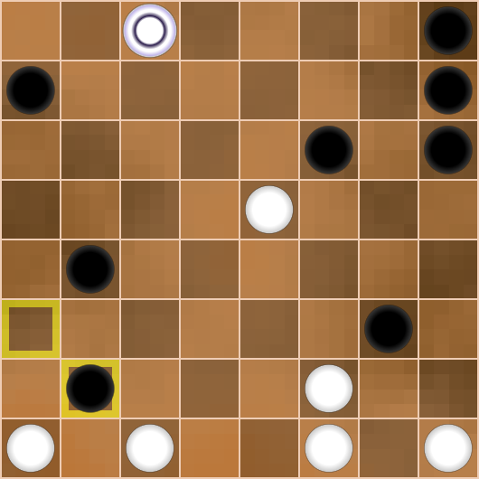

Black goes for a big risk, as the checker e5 is potentially the second king. However, there are a large number of players who cannot defend for a long time and due to their character prefer to take action. For this reason, advice like ‘you should play this way’ or ‘you shouldn't do that’ should be considered with caution. Each of us has our own tastes, character and preferences.
Taking a risk, Black gets a strong counterplay thanks to pieces b4, b2 and g3.

Let's think about how White can stop the Black onslaught. 
Straightforward manoeuvre e5d6?! comes across a strong move b4b3!, after which White's defence is cracking at the seams in points b1 and h2. Moreover, the material advantage may be on Black's side, in addition, the powerful column h8-h7-h6 will have no obstacle on h1. Even without counting the variants it is clear that this way does not give White an advantage. On Black's way to getting a few kings must be maximally difficult tasks - this is the right direction of thought for White!
The expected move e5d6 does not hinder Black's plans at all, so White should use the mobility of its king to constantly harass Black's pieces and prevent them from living in peace.

*22.c8a8!   ...*  

The point of this attack is that Black can't get a king after   

*22...      b2b1?*  
*23.a8:a6:g6:g1!  b1:e8*  
*24.f1e2*, 2:0, the black king is catching.

Black must see it in advance!  

Therefore, the correct answer is  

*22...      a7b6!*  
*23.a8a2!   b2b1*  
*24.a2a4    ...* 

Diagr. 15  

That's exactly how White should bother Black!
Elimination of the checker e5 would solve all problems for Black, but after b1:e6 - a4:e8 Black's chances for a draw are minimal.  

*24...      b1:g1!*
*25.a4:f8   ...*

Diagr. 16
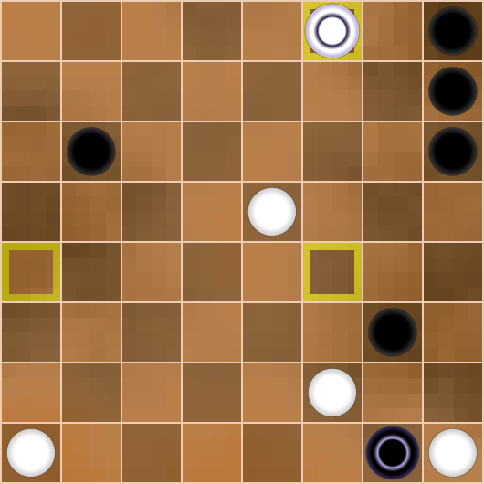

Black's material advantage must not be misleading, for if White gets a second king, it will be no laughing matter for Black.
In this position, preventive defence manoeuvres such as  

*25...    g1d1*  

lead to a painful and heavy game for Black after  

*26.e5f6!  ...* 

White threatens combination hits connected with moves f2f3 and f6g7. For this reason it is impossible to play either d1d7 or d1e1.  
Meanwhile, White threatens to get a second king and completely torture Black.

Another try is much better for Black:  

*25...      g1f1!*  

Now it is bad to catch the black king by e5f6, as the white king will be caught in response on the h3 field after h7g6.  
Try to see this variation in your mind.  

It seems that White is forced to give way to black checker g3, but not everything is so simple!  

*26.f2e3!    g3f2*  

This is the most natural move for Black, the second king will be on the next move, and now it seems that White has big problems, but  

*27.e5f6!   ...* 

Diagr. 17  
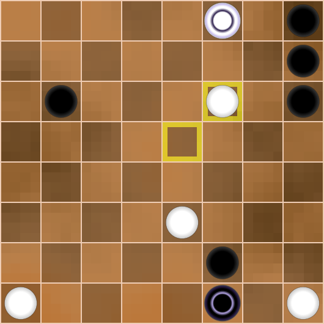

The confrontation of kings f8-f1 is extremely dangerous for Black, and f2e1?? immediately loses because of f8g8!! A panic escape like f1d1 is followed by the strike f6g7, and again 2:0.  

This is the moment when the player needs equanimity and a fresh head.
I suppose that the best solution for Black is to go to the king's ending after

*28...      f2g1!*  
*29.e3e4    f1:f7*  
*30.f8:a6   g1g5!*  

Diagr. 18
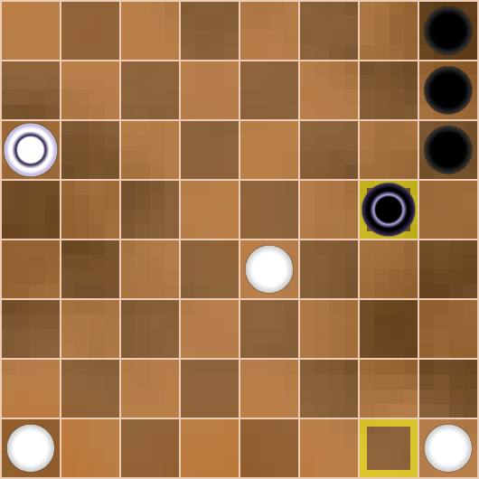

Of course, you should prevent the movement of the checker e4.

*31.a6a5    ...*  

White, on the contrary, tries to provide a path for its checker, the king on the edge of the board serves this purpose perfectly. 

*32...      h8g7!*  

Black doesn't want to play under pressure and exchanges kings, approaching checker h6 on 2 fields forward.  

*33.a5:h5   h6:h4*  

Diagr. 19  
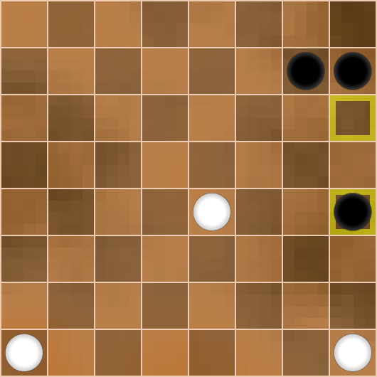

Well, both sides get kings at the same time, but Black has another subtle point to consider.  

*34.e4e5    h4g3*  
*35.e5e6    g3f2*  
*36.e6e7    f2f1*  
*37.e7e8    ...*

Diagr. 20  
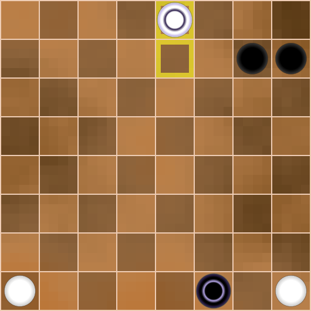

Despite its apparent simplicity, the position still has many nuances and requires a certain technique from the player.  
Black must realise that the checker a1 cannot be stopped, because the field a8 is controlled by White.  
In addition, Black should not double checkers on the vertical ‘h’, as they will bump into the checker h1, and the neighbouring vertical ‘g’ will also be controlled by the white king from the field g8. This is unpleasant and will give White additional opportunities.  
Therefore, Black should break through the centre.  
In addition, we should clearly understand that the player who gets the second king first wins.  

Then the following moves are possible:  

*37...      g7f6*  
*38.a1a2    f6f5*  
*39.a2a3    f5f4*  
*40.a3a4    f1e1*  

Diagr. 21  
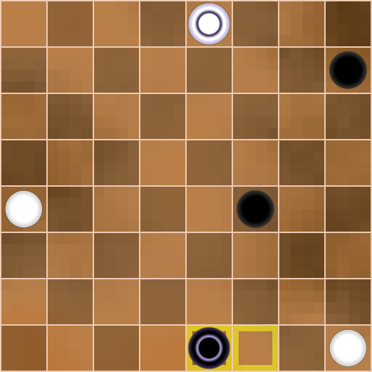

Black takes away from White vertical ‘e’, and the struggle is escalated to the limit. Again, never think that such endings are draws, it is a mistaken opinion! Perhaps a deep analysis will confirm that the chances of the sides are equal, but in practice in the vast majority of cases some player wins.  

*41.e8h8    h7g6*  

Capturing the white king with 41... e1b4 is no answer for Black, as the lonely king is forced to painfully defend against two edge pieces.

*42.h8h3    g6f5*  

It is clear that Black could not attack checker a4 from the field a1, as White would in turn attack 2 checkers and win.  
Therefore Black keeps its pieces together, not apart.

*43.a4a5    e1a1*  

Diagr. 22  
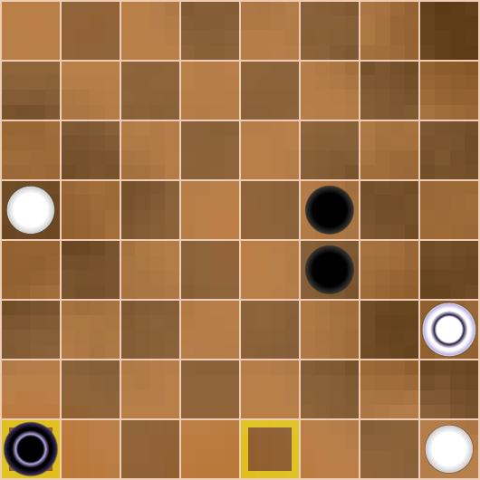

White should not exchange its active checker a5 for any black checker, because the remaining last simple checker of Black has a significant advantage in development over the checker h1.  
This fact gives Black a great chance to win, as the ending 2 kings vs. king+ checker is won for the strongest side.  

*44.a5b6    a1a3*  
*45.h3g2    f5f3*  
*46.b6b7    ...*

Diagr. 23  
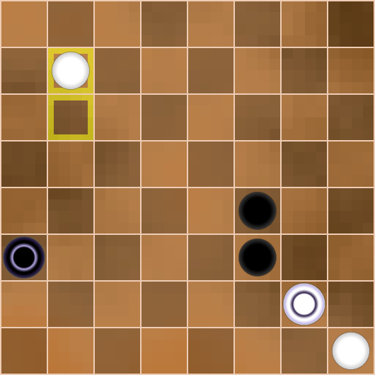

Now it's immediately losing, the move

*46...      a3a2?*  
*47.b7a8    a2:h2*  
*48.h1:h3   f3g2*  
*49.a8a1     ...*

2:0, as the white king controls the h8 field.

It looks better

*46...      a3a8*  
*47.g2h2    f4g3*  
*48.h2b2    a8a2!*  

Diagr. 24
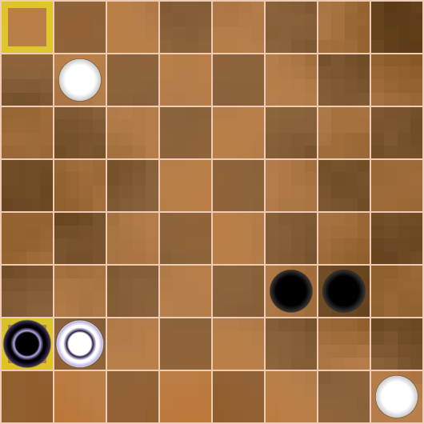

That's how sharp positions can arise from simple endings! Both sides are looking for the final waiting moves.  

*49.b2a1    a2a8*  
*50.a1b2    a8a2*  

There are probably still ways to escalate the fight further, but I suppose it's wise to settle for a draw by repeating moves.  
If Black wants to play aggressively like a8h8 with the threat of g3h2, then after cold-blooded b7a8! White wins. 

Well...as we see, the game ends in a draw!

So, in general, Continuation 1 is a saving for Black but Black's way has many obstacles and tricky game moments and the reader could see how difficult this path is for the ordinary man.  
Maybe Black would have an easier time playing in other continuations? Let's consider them.

Diagr. 8

Continuation 2.

*19...                      e6:e4*  
*20.c2a2                    g5:g3*  
*21.a2:a5:g5:g7:e7:e3:h3    ...*

Diagr. 25

According to the majority rule, the latest capture of White is correct.  
This is the kind of capture that scared me during the game, as it is very difficult to resist the mobility of the king. I didn't have the energy or desire to count all the variants, I just realised that I shouldn't go into such a maze.

Black's position is close to lost and what can Black do?

*21...    f6g5!*

This move seems to be the strongest. Black threatens to capture the king (h6h5 or g5h4), hinder the attack with tempo h3a3 because of b4c3 with capture of the king.
As you can see, there are hidden resources even in difficult positions.  

Black's aim is to try to stretch White's defence by attacking on different flanks. It is useful to set traps for the white king.  
This is easy to advise, but how to implement it in the game? 

White's task is also clear: to hinder the opponent's plan and gradually exchange pieces, increasing the king's strength.

*22.h3c3    g5g4* (with the idea of g4g3 & h6h5)  
*23.c3a3    ...*

Diagr. 26

White with tempo attacks checker a7, there is no move b4c3, but if Black wants to capture the king by h8h5 and b7a6, White gets 2 extra pieces and wins.

*23...        b7a6* (again threatens g4g3)  
*24.f1g2!     g4h3* 
*25.f2g3      h3:f3*  
*26.a3:g3     h8h5*  

Diagr. 27

Black does not want to play b4a3, as after c1b2 this piece is also exchanged. However, these efforts are in vain.

*27.c1b2     h7h4*
*28.g2h3     h4:h2*
*29.h1:h3    h6h4*
*30.g3h2     ...*

Diagr. 28

I guess we can call it a day here, White wins.
Of course, Black could play differently, but this variant demonstrates White's defence technique.
It seems to me that Continuation 2 is unpromising for Black and gives less chances than Continuation 1.

Let's go back to diagram 8 again and evaluate the third continuation.

Diagr. 8

Continuation 3.

*19...    f5:d5*

This continuation is weaker than the previous ones and it's easier for White to get a win.

*20.c2a2                        g5:g3*
*21.a2:a4:e4:e7:g7:g5:b5:b8     ...*

Diagr. 25

There was another route with a get on the a8 field, but it is not principal any more. White has restored the material balance, has a king and a strong first line defence. In addition, after a7b6 the white king is not caught!  

Next, we are still thinking schematically and not counting any long variants.  
I propose to exchange the active black checker g3, after which Black's attack will be ineffective. I'll limit myself to an approximate variant.

*21...       f6g5*  
*22.b8e8     g5h4*  
*23.f1f3     g3:e3*  
*24.e8:e1    ...*

Diagr. 26
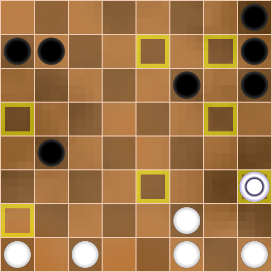

Each exchange is favourable to White and leads to a win.

*24...      h8h5*
*25.e1f1    ...*

As soon as the black piece gets to the h3 square, it will be exchanged.

*25...       a7a6*
*26.f2g3!    a6a5*
*27.g3g4     h4:f4*
*28.f1:f8    ...*

2:0.

Diagr. 27
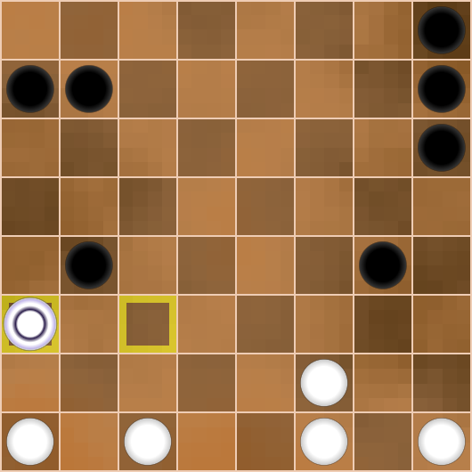

Afterwards White arranges a blockade on the second horizontal and in the point h2, and the checker a5 is easily stopped.  
I purposely do not consider this ending in detail, as such positions need to be felt without counting variants.

Thus, we conclude that in the position in diagram 8 White has a good chance to win. Only in Continuation 1 can Black hope for a draw after overcoming significant difficulties.

Let's go back to the main flow of the game and to Diagram 5.

Diagr. 5

Of course, I didn't see anything like this during the game, but I found the move 19.e4e5, which gives White wide opportunities. I got scared and refused the method of defence 17...g7g5.

But I had to find another line of defence!
How did I reason? The white king is very strong and to limit it somewhat, I should not create weak fields in my camp, i.e. keep the checker massif compact. Besides, I wanted to keep my a3 and b4 pieces at all costs to scare my opponent with a breakthrough on both flanks.

**17...    h6g5!**

This move is the straw I grasped at when diving to the bottom. Indeed, Black does not weaken the g7 field, maintaining a monolithic mass. Now all the above-mentioned combinations do not work. On top of that, I'm preparing a stealth strike.

**18.g4h5    g7h6!**

An unexpected answer.

**19.h5:f5    h3h2**  
**20.h1:h3    g6g5**  
**21.f5:h5    h6:h2** 

Diagr. 28

Among other things, Black threatens to capture the king after b4c3.
As soon as this position happened in our game, I saw a combination that made my heart freeze:

*22.e4e5    e6:g4*  
*23.f2e3    h2:f2*  
*24.c2:a2   ...*

Diagr. 29
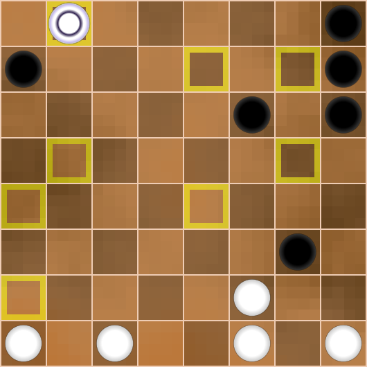

If the white king had taken a different route and captured the b4 checker, it would be caught after b7b6. But of course, Ray would have seen it.

What to do now? Yes, I could catch the king by the а7а6 way, but then I would be without a checker. That's dangerous!
But I intuitively felt that I might be saved after

*24...       b4b3!*  
*25.a2:a8    b3b2*

Diagr. 30
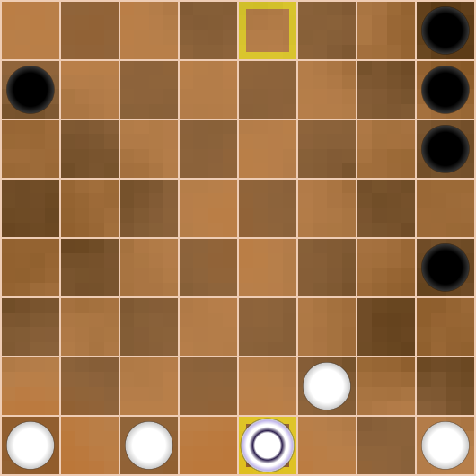

I felt a sense of relief since this doesn't work:

*26.с1с2?    b2:d2*  
*27.a8b8     b7a6*  
*28.b8b1     a6b5*

and the white king is caught, 0:2. Fortunately, White doesn't win here, and my heart beat a little more evenly.

Back to the main game and diagram 25.

Diagr. 25

**22.f2g3    h2:f2**  
**23.c2:g2   ...**

It's an easily understandable exchange of a person who wants to feel solid ground under his feet.

Diagr. 31
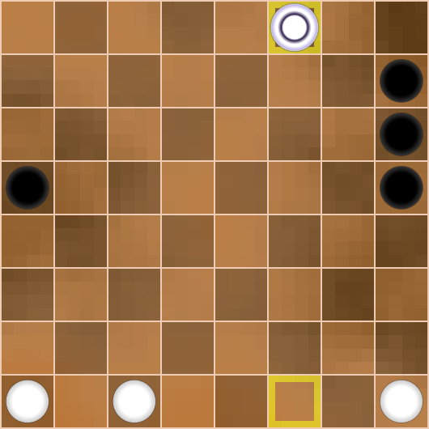

I considered f7f5 here, but the attack on 2 pieces often leads to trouble. White has a strong answer:

*24...       f7f5?*  
*25.e4e5!    ...*

1.the 2x2 exchange

*25...       e6:g4*  
*26.g3:e5    b7c6*  
*27.g2a2     ...*

 led to a quick victory for White due to the dispersed Black forces;

2.after

*25...       f5:h3*  
*26.e5:e7    h3h2*  
*27.e7f8!    h2:f2*  
*28.f8:g2     ...*

2:0. I suggest the reader to calculate this variant in his mind.

I decided to leave the move f7f5 in reserve, and in the meantime set a small trap.

**23...     b4b3**

Diagr. 32
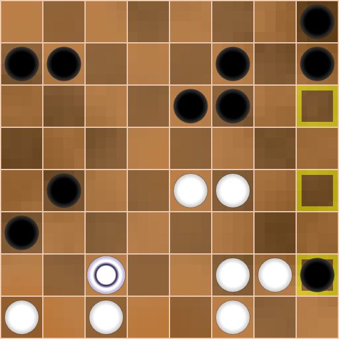

Firstly, you shouldn't despair, you should fight on!
Secondly, Black straightens the broken checker formation b4-a3, it will not allow white king to destroy them with slalom.  
Thirdly, White's active attack g3e5 in view of e6d5 and f7g6 gives nothing to White, Black catches the opponent's king and threatens to get a king with material advantage.  
Fourthly, I provoke my opponent to an attack

*24.g2a2    b7a6*
*25.a2:a4   b3b2*

Diagr. 33
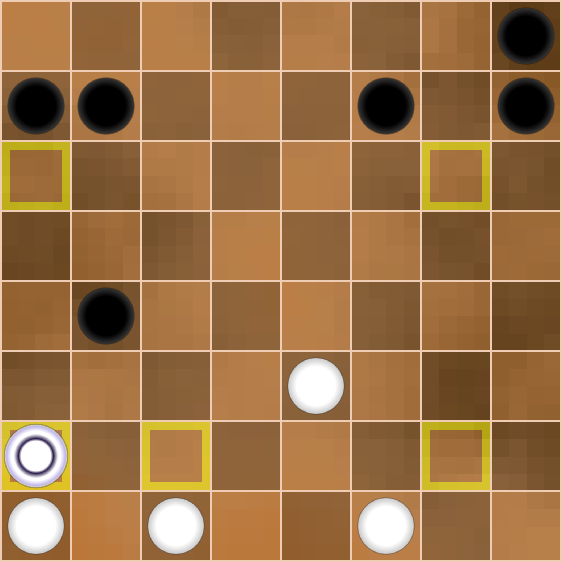

If Black gets the king, White may lose. Maybe this fact frightened my partner a lot and he refused to do it.  
But there was really nothing to be afraid of!  

*26.a4d1!   ...*

White potentially threatens to play c1c2, but so far the king is caught. However, with g3e5 White can destroy the opponent's position, so I intended to play here  

*26...      e6d5*  
*27.d1:g6   b2b1* 

Diagr. 34

*28.g6g8!   b1:g5*  
*29.g8:g1   f7g6*  

Counting up to this position, I made sure that the white king is still caught, but in the heat of the fight I didn't realise that despite Black's material advantage, White wins!

*30.g1:g8   h8:f8*  
*31.e4e5!   ...*  

Diagr. 35 
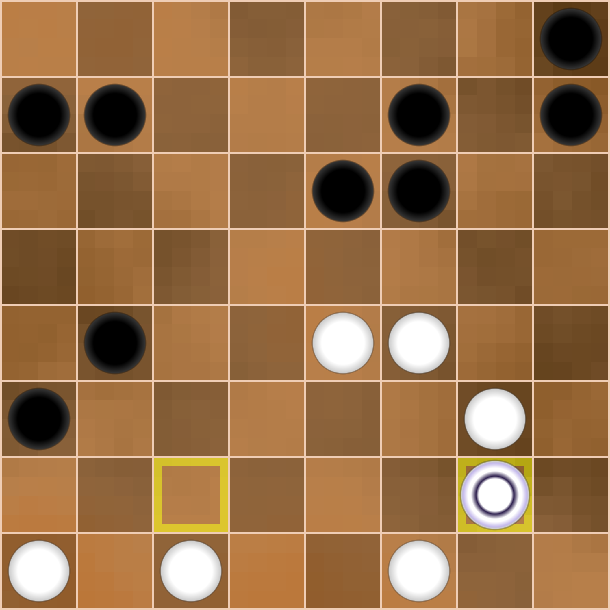

White is very much ahead of the opponent in development and gets two kings at once! Black's position is lost, I suggest the reader to check it by himself.  

Thus, the direct attack 24.g2a2 with high probability led to White's victory.  

Let's go back to the main diagram 32 again.  

Diagr. 32  

Ray probably considered the move

*24.g3e5    ...*  

but saw that after  

*24...      e6d5!*  
*25.e5:c5   f7g6*   
*26.g2:g8   h8:f8*  

Diagr. 36  
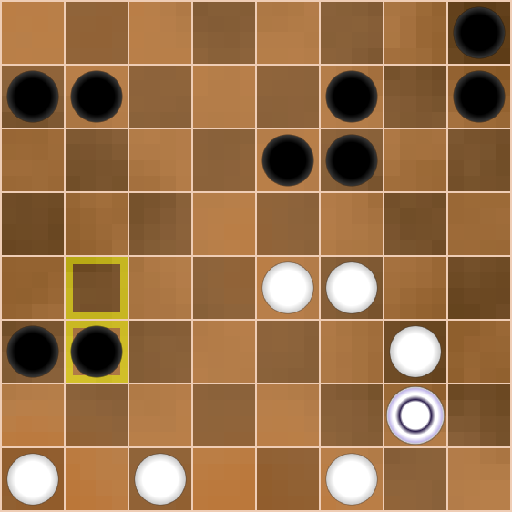

Black first gets a king and has an extra checker.

In the position of diagram 32 Ray had a quiet move f4e5. The advantage of this move over g3e5 is that the vertical ‘g’ is not opened, and the white king is not caught! After the answer h8g7 there will be an exchange on the e7 square, this creates an extremely difficult game for both sides, in which it is easy to make an unforced mistake.  
For example:

*24.f4e5    h8g7*  
*25.e5:e7   f7:d7*  
*26.g2a2?   b7a6*  
*27.a2:a4   b3b2*  

Diagr. 37
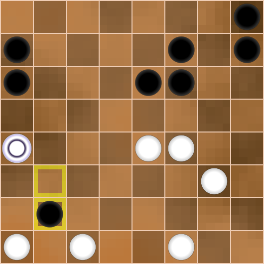

Suddenly it turns out that it is bad to play a4d1 because of b2b1, and White is forced to capture the checker d7, clearing the way for the black king, 0:2.  

As we can see, in this edition the attack g2a2 is ineffective and should be limited to capturing space by 26.e4d5 with an extremely complicated game.

But White missed this chance to fight for the win.  
It was psychologically difficult to play under such a pressure of threats, Ray wanted clarity and went for further simplification of the position.  

Diagr. 32

**24.c1b2?!    b3:b1**  
**25.a1:c1     f7f5!**

Diagr. 38

Checkers a1 and b4 have disappeared from the board, so White's possibilities are sharply narrowed. But this should have been foreseen in advance!

Without checker a1, the a2 field is inaccessible to the White king. In addition, the black piece b4 made Black's position lattice, and now this piece is missing.  
For example:

*26.е4е5?    f5:h3*  
*27.e5:e7    h3h2*

Diagr. 39
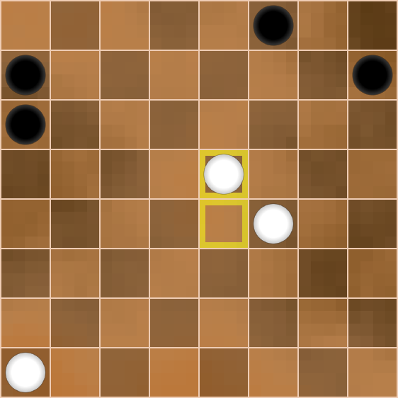

With checkers a1 and b4 White wins by simple e7f8 as shown above, but in the position of diagram 39 only Black can win, as White has little strength and few possibilities against the opponent's offensive.
I suggest the reader to convince himself of this.

Let's look again at diagram 38.

Ray had one last opportunity to continue the fight with a combination:

*26.f4g5!   f5:h5*  
*27.e4e5    e6:e4*  
*28.g3f4    e4:g4*  
*29.g2:a1   b7a6*

Diagr. 40
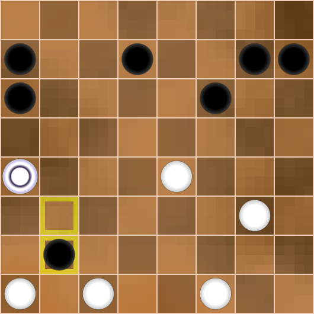

Learn to evaluate such positions without counting variants!  
White's task is to repel the attack on the two outermost verticals.  
To do it move checker c1 to vertical ‘a’ and exchange it for 2 black pieces, white king gets to the field a8 and controls from there the fields h1 and a1. If Black gets to h1, its king will die immediately after a8a1.  
It seems to be a draw!  

What if Black refuses to exchange on line "a"? Then White will get a second king, which is only advantageous for White.  

I'll show the demo variant below for the sake of order:

*30.c1b2    h8h6*  
*31.b2a3    h7h4*  
*32.a3a4    h6h3*  
*33.a4a5    a6:a4*  
*34.a1:a8   h5h2*

Diagr. 41
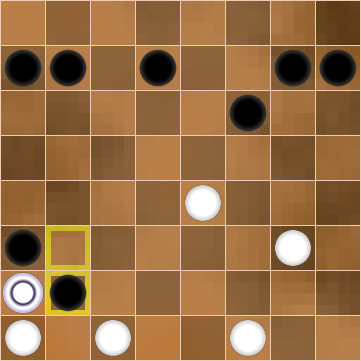

Then White makes any move with king controlling the a1 field.  
Simplifying the narrative:

*35.a8a2    h4h1*
*36.a2a1    h1:e1*
*37.a1:h1   h3g2*

Draw!
Well... That would be a fair result of such a battle!

Let's go back to diagram 38 from the real game.

Diagr. 38

But Ray refused this continuation or just didn't see it. I think he was very tired by this moment and was prone to make drastic decisions.

**26.g2a2?    ...**

It is likely that this abrupt move is the crucial mistake.

**26...      f5:h3**  
**27.a2:a8   h3h2**

Diagr. 42
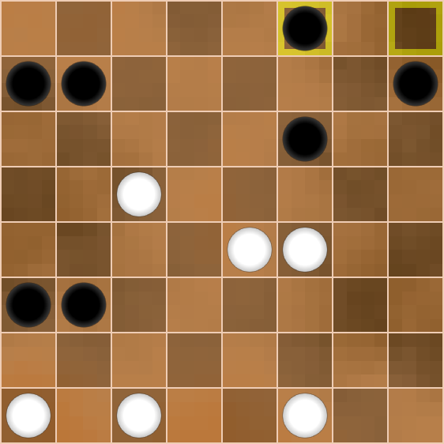

**28.a8a2?   ...**

It's already a surrender of all positions. Now White loses immediately. Unfortunately, Ray didn't have enough strength for the whole game, especially such a tense and complicated one. Each of us has our own limit, own ceiling, own peak.
Perhaps Ray did not take into account that the king on h1 attacks in two directions.

**28...     h2h1**  
**29.a2b1   h1:e5**  
**30.b1:b8  ...**  

Diagr. 43

Black's material advantage is too great. Still was played:

**30...     e6f5**  
**31.b8e8   e5e1**  
**32.e8h5   ...**  

Diagr. 44
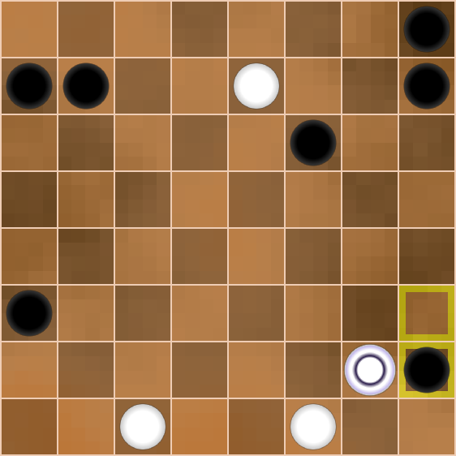

**32...     e1:a1**  
**33.h5:d5  f6g5**  
**34.d5:h5  h7h6**  

White surrendered, 0:2.

Of course, in the position of diagram 42, it was necessary to play

*28.a8a1!    ...*

Now Black's king can be caught after h2h1 - f1e2, so I must first distract the white king.

*28...       b7a6!*  
*29.a1:a8    h2h1*

Diagr. 45

*30.e4f5!    h1:a1*  
*31.f5:f7    ...* (threatens f7g8, draw)  
*31...       h8h6*

Diagr. 46

White gets a second king, but the chances of winning here are only for Black. The analysis of this position can be endless, the fight could go on for a long time but with careful play Black can get a winning ending of kings like 3x2. 

Let's summarise.  

The game turned out to be extraordinarily complicated, but I believe the reader could learn a lot, as I did.

My opening plan almost succeeded, but I thought that winning was already easy, and Ray punished me for that with a brilliant combination. After getting the king, White also had a great chance of winning, but I woke up and started to fight back desperately. The position was full of complex variants and perhaps suited my style more than Ray's. With each move my energy was rising and Ray's was falling.  
My move 23...b4b3 had the purpose to frighten the opponent and put pressure on his position. If Ray had kept his cool, he could punish me a second time for my risky style of play, but I was lucky.  
Another opportunity for Ray to put me in big trouble was move 24.f4e5. To be honest, I don't know how the game would have ended then. Let it remain a little secret of our meeting.  
White played better for the lion's share of the whole game, but in the end Ray didn't have enough strength.  

This memorable victory allowed me to get 1 point ahead of such monsters as Busybee and Diamante at the last moment and take 1st place in the tournament.  
Ray Garrison performed very well, taking the place right behind us.
