<link rel="stylesheet" type="text/css" href="styles.css">

## GAME №2  
Ray Garrison vs Beginner_2017  
littlegolem.net  
Tournament: draughts.cv.DAMEO.5.1.1  
2018  
  
Sometimes I come across games that are impossible to analyse because of Dameo's infinity. Yes, sure, I can dive deep enough, but the abundance of variants and continuations discourages me.  

Now I'm going to tell you about one such game. It will be a long story, but I'd like the reader to fully feel that an ordinary 8x8 board can be like a cosmos with infinite stars.  

My meetings at the board with Ray Garrison are often of a memorable character. Ray is a very pleasant partner and conversationalist; he reads a lot and has a deep knowledge. Although I don't know him personally, but only by correspondence, I have a strong feeling that I am talking to a gentleman from the 19th century - well-mannered, tactful and friendly.  

One of our first fights took place in 2018. I had known Dameo for less than a year and tried to experiment a lot. I was still a ‘raw’ player, without style or understanding, but with a huge desire and energy. Having watched a few of Ray's games before this game, I realised that he is a classical style player, preferring reliable structures with traps a1-c1 and h1-f1 against the opponent's king.  
So, I decided to challenge such a strategy…

**1.g1-h2	e7-e5**  
**2.e1-g3	d7-d5**  
**3.b1-a2	g8-h7**  
**4.d2-d4	d8-b6**  
**5.c2-c4	...**

Diagr. 1

I won't dwell on the first moves, as they can be almost any. The main thing is the future plan.
It was at this point that I decided to take a radical step to try to throw my opponent off his equilibrium by any means.  

**5...    c8a6?!**  
**6. d1g4	f8h6?!**

Diagr. 2

How to comment on these moves by Black? Any slightly experienced player will see the obvious disadvantages and criticise it. Indeed, Black is exposing its rear and burning all bridges. Once White gets a king, it will be impossible to catch it on the 8th row.  

However, such a development has a plus: Black has extra checkers in the struggle along the entire clash line. I expected to suppress White by the number of my checkers and supposed that this pressure will compensate for all the disadvantages of my decision. For example, Black already has a 5 vs. 3 advantage on verticals ‘a’ and ‘b’.  

This plan, but only in a less radical form, I sometimes apply it now.

**7.a2b3?	b8a7**

The move a2b3 seemed a bit strange to me. On the contrary, playing for White, I would try to block the vertical ‘a’ by e2b5! and c4:a4. But White loses its sense of danger, allowing Black to create an attack on the flank.

**8.h2f4	...** (with the idea of f3f5)  
**8...		e8g6**

Diagr. 3

Picture position!
Black managed to get an advantage on the flanks, and its square d6-e6-e5-d5 holds the defence in the centre.

**9.e2e4	  a8a5**  
**10.b2a3	  a5a4**  
**11.a3:a5  a6:a4**  
**12.c3b4!?  ...**

Diagr. 4

Black consistently carries out its plan and the flank attack already looks threatening. Indeed, Black has an advantage in strength (6 vs. 5), as well as freedom for manoeuvres and accumulation of forces. White is constrained and clamped.  

Realising that passive defence is unlikely to be successful, Ray resorts to a desperate measure, risking to lose immediately, but builds a trap...

**12...		c7c5?**

It was played with the wrong piece! Believing that the position is won almost automatically by attacking the checker c4, I played the checker c7. I remember that I was afraid of some penetration on a6 and left my checker on a7.  

But who would have thought that it needed to protect not the a6 field, but the d7!
My move looks very strong, but Ray blasts the position with a landmine hidden in the depths of the board!

**13.d3b5!!	...**

Oh, my God! What is that?  

**13...		  с5:a3**  
**14.f3f5!  ...**

Where's that coming from? What's happening? I remember sitting there like I was knocked out and didn't understand anything.

**14...  		d5:h3**  
**15.f5:d7  ...**

What's the matter?! With a checker on c7, White's combination would not work!

**15...  	a4:c4**  
**16.d7c8	b6:b4**  
**17.c8:c2	...**

Diagr. 5

Well, an anomalous position has emerged on the board, where Black has four checkers for a king, and also the dangerous checkers a3 and h3. The problem is that White's king is so strong that it doesn't let Black's pieces even move because of constant hits with free tempo. For example, Black attacks a checker, and White sacrifices it on the next move, and in the meantime moves the king to the necessary place. Black is forced to capture the prey, and White's king destroys a large enemy force.  

Threatens not only g4g5, but also at a chance c2a2, so the  countermeasure seems to be moves e6e5, h8h5 or g7g5.  
The choice is wide, but it's more difficult to make it.  
Let's consider these continuations in order.  

### Continuation e6e5
I didn't like the exchange e6e5 for the reason that Black creates its own fragmented pieces. Against a mobile king this is almost always wrong.  
For example, after  

*17...      e6e5*  
*18.e4:e6   f6:d6*  

Diagr. 6  

I was afraid of this position, as I didn't see a good defence against 19.c2a2.  
And only now in the analysis I found a refutation of this manoeuvre.

*19.c2a2?               h6g5! (g7g5??)*  
*20.a2:a6:e6:h6:h2      g5:e1*  

Diagr. 7  
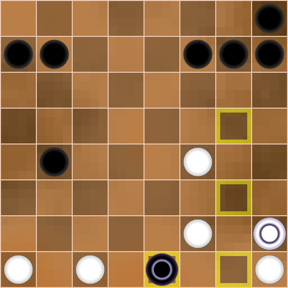

What a fantastic changing position on the board! A real kaleidoscope!  
The black king dies on the next move, but so does the white king!  
If the white king escaped, things would be bad for Black.  
Could it have been foreseen in advance? The white king is suddenly caught in a trap and Black wins! 0:2.  

Let's go back to diagram 6 again.  

Diagr. 6  

And yet my intuition didn't let me down. I rightly was fearing the fragmentation of my pieces. White can use this disadvantage by a crushing combination.  

*19.g4h5!!      h6:h4*  
*20.h1h2!       h3:h1*  
*21.c2d1        h1:e1*  
*22.d1:b1!      ...*  

Diagr. 8  
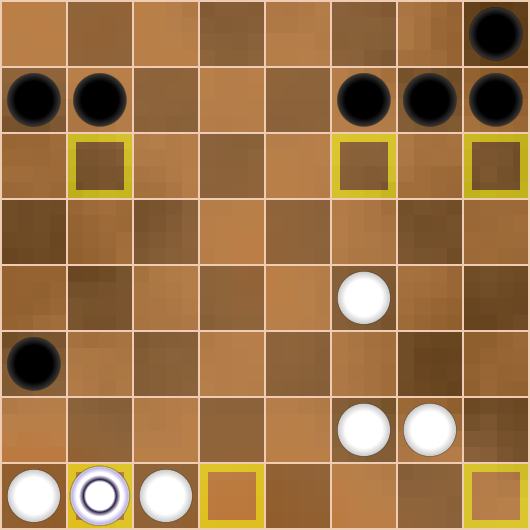

Threatens 23.b1a2.

If 22... b7a6, then 23.f4e5 and White gets the second king and wins.  

Black can catch the white king after  

*22...          b7c6*  
*23.b1a2        f7g6*  
*24.a2:h6       h7:h5*  
*25.f4e5        ...*  

Diagr. 9  
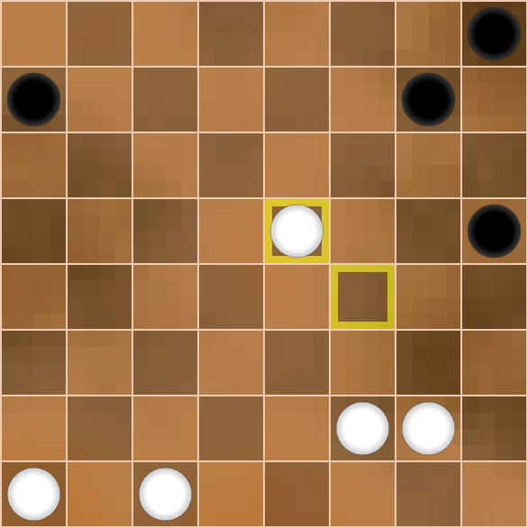

2:0.  

Let's return to the main point.  

Diagr. 5

### Continuation h8h5
This move looks stronger than the previous one. Indeed, Black keeps compactness of its pieces on the flank and builds up pressure on the line “h”.
Now it would be disadvantageous for White to play c2a2 immediately, because this move should be made at the moment when the king destroys more than 2 checkers of the opponent. Moreover, Black in response threatens a counterattack from the g5 field, attacking White's 3 pieces.  
The position on the board is extremely complex and full of combinational possibilities.  
In my analysis I found a move  

*17...      h8h5*  
*18.e4d5    ...*  

Diagr. 10  
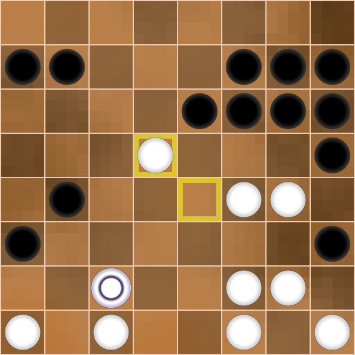

White threatens to get a second king by using the gap between the opponent's flanks. This is a very serious threat and for its realisation you can even additionally sacrifice the checker f4e5. With 2 kings, you can torture your opponent indefinitely.  
It is bad to play g7g5 because of c2d1! and White responds by taking 6 checkers with a win.
It is not easy to find a worthy answer for Black, for example:  

*18...      h6g5?*  
*19.h1h2!   g5:e1*  
*20.h2:h8   e1:b1*  
*21.a1:c1   a3a2*  

Diagr. 11  
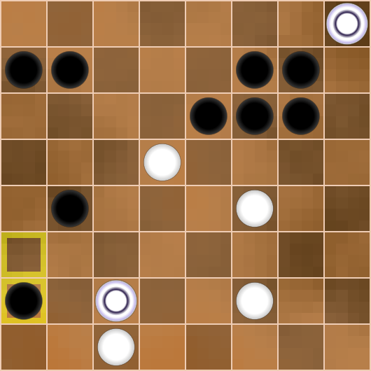

*22.d5c6    a2a1*  
*23.f4g5!   a1:h5*  
*24.h8:a8   ...*  

Diagr. 12  

Black is too far behind in development, so in the future White with 3 kings has a great chance of winning.  
Immediately loses f7h5 due to a8a7, 2:0.  

Let's go back to diagram 10 and consider a stronger move  

Diagr. 10

*18...      f6g5*  

Now begins a spectacular shootout, like a cowboy action film.  

*19.d5d6!   g5:e1*  
*20.d6:f8   e1:b1*  
*21.a1:c1   a3a2*  

Diagr. 13  
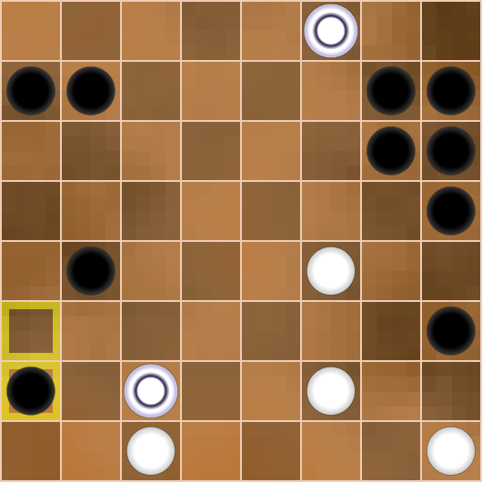

*22.f2g3    h3:f5*  
*23.f8:a1   a7a6!*  
*24.a1:c7   h7h4*  
*25.c7:h7   h6:h8*  

Diagr. 14  
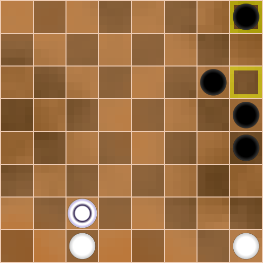

An incredible kaleidoscope of changing pictures again! This variant demonstrates well the ideas and possibilities of the sides.  
So, after the scuffle there was silence and both sides took a break.  

I think of the poet Lermontov, who wrote the poem “Borodino” about the famous battle between Napoleon and Kutuzov in 1812.  
One of the bloodiest one-day battles in world history ended in the evening without a clear winner and it was time to reflect on what had happened.  

Here is a poetic translation of a fragment from that poem:  

> Twilight descended. All were ready  
> For dawn refight advancing steady  
> To last till death us mutes...  
> Here drums-performed march hits the ear,  
> But enemy no longer near.  
> It was good time to make wounds clear,  
> To fallen give salutes.  

Now, in diagram 14, it is time for both sides to think hard about the position. Tactical thinking must now give place to strategic.  

Black's task is to create a column of four checkers along the line 'h' and exchange the white checker on h1. In this case, the white king will not be able to occupy the h1 square, as it will be immediately captured, 0:2.  
Anticipating this, White should give up the h1 square, but if the black king appears there, it must be destroyed immediately. To do this, White should keep its c1 checker until the very end.  
As we can see, both sides must act very precisely and carefully.  

*26.c2g2        h8g7*  
*27.g2h2        h5h3*  
*29.h2c2        g6h5*  
*30.c2h2        g7h6*    

Diagr. 15  
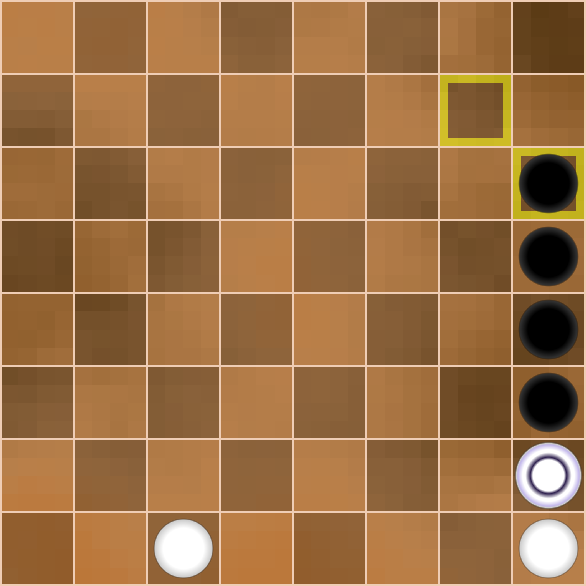

Of course, there are some branches, and the order of moves may be different. But it is important for us to see the final idea.  

Black has built an attacking column, and the white king is in danger.
Then White surrenders the entire right flank and builds a defence on the a1 square.  

*31.h2g1       ...*  

You cannot move along the second horizontal line, because after h3g2 the white king is captured.  

*31...          h3h2*  
*32.h1:h3       h4:h2*  
*33.g1d4        ...*  

White can make any move that controls the a1 square.  
It is obvious that the first black king will be captured, and the second king can only appear after sacrificing one more piece.  
The result is a draw, 1:1!  

Well, let's look at the third continuation from diagram 5.  

Diagr. 5

### Continuation g7g5
Black with a tempo attacks white pieces and at the same time threatens to catch the king by b7c6.  
What else can be demanded from such a strong at first glance solution?  
I noticed a long time ago that in abnormal positions simple logical moves do not lead to the goal, because these kinds of positions require abnormal decisions :).  

It would seem that the most obvious move g7g5, which most players would make, is the best solution, but alas, White has an impressive counter-punch from which goosebumps run down my skin.  

Again, the move g7g5 exposes Black's rear too much, in particular the g7 square, and White emphasises this fact with a crushing combination:  

*17...      g7g5*  
*18.g4f5!!  g5:e3*  
*19.g2f3!   e3:g3*  
*20.h1h2    h3:h1*  
*21.c2d1    h1:e1*  
*22.d1:a2   ...*  

Diagr. 16  
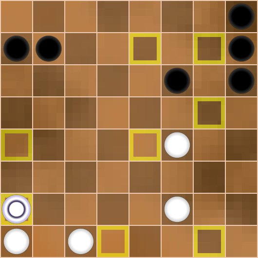

This is how the weakness of the g7 square turned out so badly for Black!  
White has a second potential king (f4), an extremely mobile king on a2, and the a1-c1 trap. All these factors must lead to victory for White, 2:0.  

Of course, it is impossible to show all the moves and variations for both sides from the position in diagram 5, as this would take up a lot of space and time, but I believe the general picture is clear to the reader.  
The second continuation h8h5 allows Black to keep the position under control, but this only became clear as a result of analysis.

### Continuation of main line
Let's go back to the main flow of the game and to Diagram 5.

Diagr. 5

Of course, I didn't see anything like this during the game. I got scared and gave up on the above methods of defence.

But I had to find another line of defence!
How did I reason? The white king is very strong and to limit it somewhat, I should not create weak fields in my camp, i.e. keep the checker massif compact. Besides, I wanted to keep my a3 and b4 pieces at all costs to scare my opponent with a breakthrough on both flanks.

**17...    h6g5!**

This move is the straw I grasped at when diving to the bottom. Indeed, Black does not weaken the g7 field, maintaining a monolithic mass. Now all the above-mentioned combinations do not work. On top of that, I'm preparing a stealth strike.

**18.g4h5    g7h6!**

An unexpected answer.

**19.h5:f5    h3h2**  
**20.h1:h3    g6g5**  
**21.f5:h5    h6:h2** 

Diagr. 17

Among other things, Black threatens to capture the king after b4c3.  
Here, nothing gives White a combination

*22.e4e5    e6:g4*  
*23.f2e3    h2:f2*  
*24.c2:a2   ...*

Diagr. 18

If the white king had taken a different route and captured the b4 checker, it would be caught after b7b6. But of course, Ray would have seen it.

*24...       b4b3!*  
*25.a2:a8    b3b2*

Diagr. 19
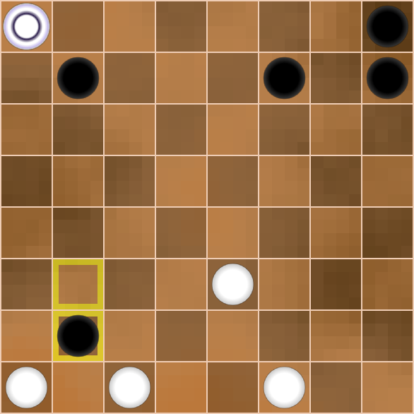

and Black's position is at least no worse.  

Back to the main game and diagram 17.

Diagr. 17

**22.f2g3    h2:f2**  
**23.c2:g2   ...**

It's an easily understandable exchange of a person who wants to feel solid ground under his feet.

Diagr. 20
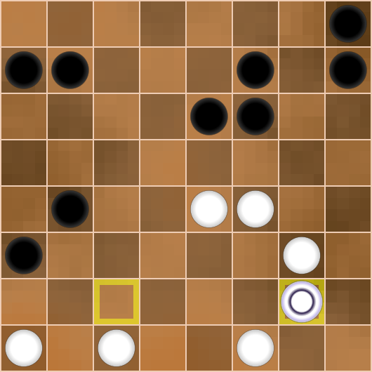

I considered f7f5 here, but the attack on 2 pieces often leads to trouble. White has a strong answer:

*24...       f7f5?*  
*25.e4e5!    ...*

1.the 2x2 exchange

*25...       e6:g4*  
*26.g3:e5    b7c6*  
*27.g2a2     ...*

 led to a quick victory for White due to the dispersed Black forces;

2.the 1x2 exchange

*25...       f5:h3*  
*26.e5:e7    h3h2*  
*27.e7f8!    h2:f2*  
*28.f8:g2     ...*

2:0. I suggest the reader to calculate these variants in his mind.

I decided to leave the move f7f5 in reserve, and in the meantime set a small trap.

**23...     b4b3**

Diagr. 21
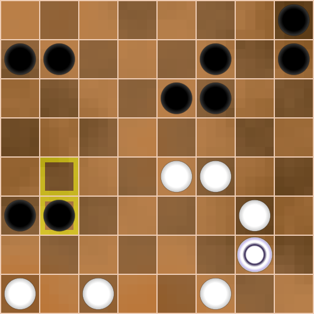

Firstly, you shouldn't despair, you should fight on!
Secondly, Black straightens the broken checker formation b4-a3, it will not allow white king to destroy them with slalom.  
Thirdly, White's active attack g3e5 in view of e6d5 and f7g6 gives nothing to White, Black catches the opponent's king and threatens to get a king with material advantage.  
Fourthly, I provoke my opponent to an attack

*24.g2a2    b7a6*  
*25.a2:a4   b3b2*  

Diagr. 22

If Black gets the king, White may lose. Maybe this fact frightened my partner a lot and he refused to do it.  
But there was really nothing to be afraid of!  

*26.a4d1!   ...*

White potentially threatens to play c1c2, but so far the king is caught. However, with g3e5 White can destroy the opponent's position, so I intended to play here  

*26...      e6d5*  
*27.d1:g6   b2b1* 

Diagr. 23
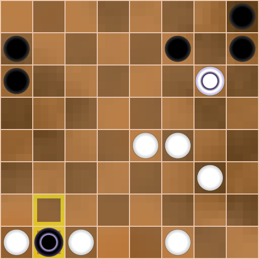

*28.g6g8!   b1:g5*  
*29.g8:g1   f7g6*  

Counting up to this position, I made sure that the white king is still caught, but in the heat of the fight I didn't realise that despite Black's material advantage, White wins!

*30.g1:g8   h8:f8*  
*31.e4e5!   ...*  

Diagr. 24

White is very much ahead of the opponent in development and gets two kings at once! Black's position is lost, I suggest the reader to check it by himself.  

Thus, the direct attack 24.g2a2 with high probability led to White's victory.  

Let's go back to the main diagram 21 again.  

Diagr. 21

Ray probably considered the move

*24.g3e5    ...*  

but saw that after  

*24...      e6d5!*  
*25.e5:c5   f7g6*   
*26.g2:g8   h8:f8*  

Diagr. 25  

Black first gets a king and has an extra checker.

In the position of diagram 21 Ray had a quiet move f4e5. The advantage of this move over g3e5 is that the vertical ‘g’ is not opened, and the white king is not caught! After the answer h8g7 there will be an exchange on the e7 square, this creates an extremely difficult game for both sides, in which it is easy to make an unforced mistake.  
For example:

*24.f4e5    h8g7*  
*25.e5:e7   f7:d7*  
*26.g2a2?   b7a6*  
*27.a2:a4   b3b2*  

Diagr. 26  
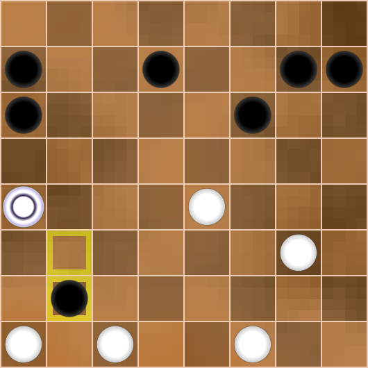

Suddenly it turns out that it is bad to play a4d1 because of b2b1, and White is forced to capture the checker d7, clearing the way for the black king, 0:2.  

As we can see, in this edition the attack 26.g2a2 is ineffective and should be limited to capturing space by 26.e4d5 with an extremely complicated game.

But White missed this chance to fight for the win.  
It was psychologically difficult to play under such a pressure of threats. Ray wanted clarity and went for further simplification of the position.  

Diagr. 21

**24.c1b2?!    b3:b1**  
**25.a1:c1     f7f5!**

Diagr. 27

Checkers a1 and b4 have disappeared from the board, so White's possibilities are sharply narrowed. But this should have been foreseen in advance!

Without checker a1, the a2 field is inaccessible to the White king. In addition, the black piece b4 made Black's position lattice, and now this piece is missing.  
For example:

*26.е4е5?    f5:h3*  
*27.e5:e7    h3h2*

Diagr. 28

With checkers a1 and b4 White wins by simple e7f8 as shown above, but in the position of diagram 32 only Black can win, as White has little strength and few possibilities against the opponent's offensive.
I suggest the reader to convince himself of this.

Let's look again at diagram 27.

Ray had one last opportunity to continue the fight with a combination:

*26.f4g5!   f5:h5*  
*27.e4e5    e6:e4*  
*28.g3f4    e4:g4*  
*29.g2:a1   b7a6*

Diagr. 29
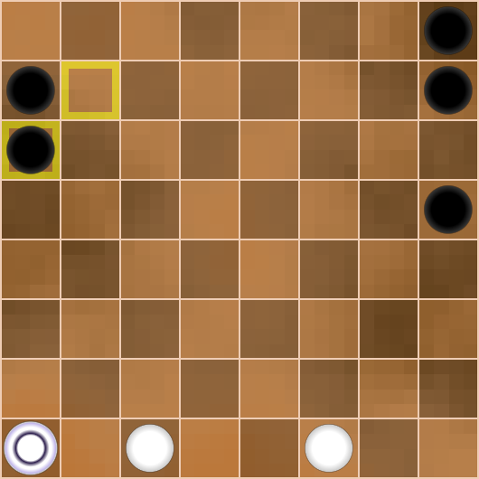

Learn to evaluate such positions without counting variants!  
White's task is to repel the attack on the two outermost verticals.  
To do it move checker c1 to vertical ‘a’ and exchange it for 2 black pieces, white king gets to the field a8 and controls from there the fields h1 and a1. If Black gets to h1, its king will die immediately after a8a1.  
It seems to be a draw!  

What if Black refuses to exchange on line "a"? Then White will get a second king, which is only advantageous for White.  

I'll show the demo variant below for the sake of order:

*30.c1b2    h8h6*  
*31.b2a3    h7h4*  
*32.a3a4    h6h3*  
*33.a4a5    a6:a4*  
*34.a1:a8   h5h2*

Diagr. 30
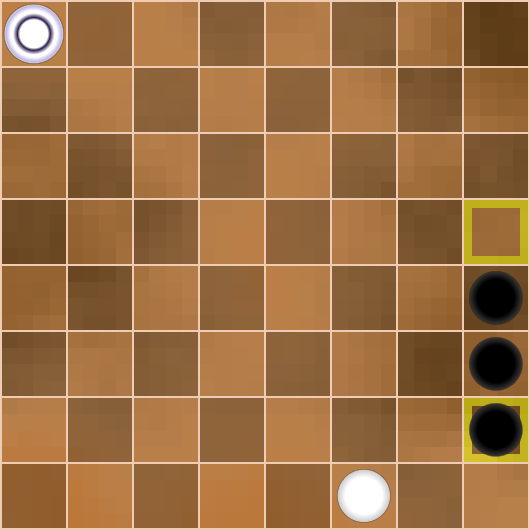

Then White makes any move with king controlling the a1 field.  
Simplifying the narrative:

*35.a8a2    h4h1*  
*36.a2a1    h1:e1*  
*37.a1:h1   h3g2*

Draw!
Well... That would be a fair result of such a battle!

Let's go back to diagram 27 from the real game.

Diagr. 27

Perhaps Ray simply did not see the continuation 26.f4g5. I think he was very tired by this moment and was prone to make drastic decisions.

**26.g2a2?    ...**

It is likely that this abrupt move is the crucial mistake.

**26...      f5:h3**  
**27.a2:a8   h3h2**

Diagr. 31
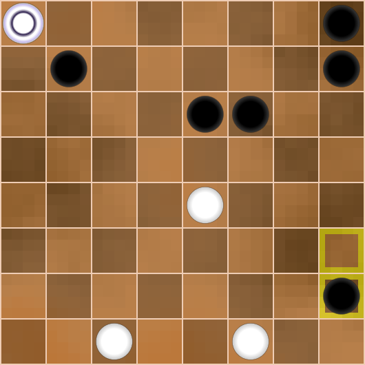

**28.a8a2   ...**

It's already a surrender of all positions. Now White loses immediately. Unfortunately, Ray didn't have enough strength for the whole game, especially such a tense and complicated one. Each of us has our own limit, own ceiling, own peak.
Perhaps Ray did not take into account that the king on h1 attacks in two directions.  
The move 28.a8a1 prolonged the struggle, but did not save the game.  
In this case, Black would first distract the king with 28...b7a6, and then play 29...h2h1, attacking two pieces in two directions and getting a winning endgame.

**28...     h2h1**  
**29.a2b1   h1:e5**  
**30.b1:b8  ...**  

Diagr. 32
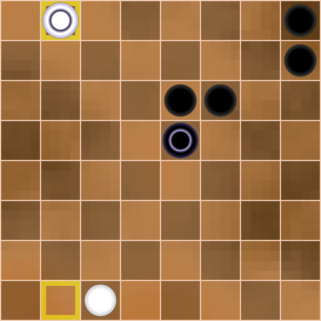

Black's material advantage is too great. Still was played:

**30...     e6f5**  
**31.b8e8   e5e1**  
**32.e8h5   ...**  

Diagr. 33
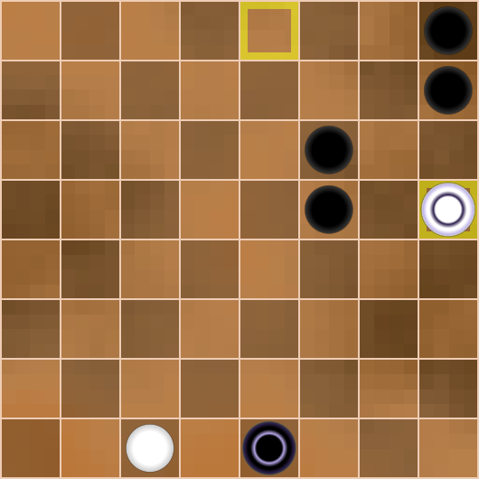

**32...     e1:a1**  
**33.h5:d5  f6g5**  
**34.d5:h5  h7h6**  

White surrendered, 0:2.

Let's summarise.  

The game turned out to be extraordinarily complicated, but I believe the reader could learn a lot, as I did.

My opening plan almost succeeded, but I thought that winning was already easy, and Ray punished me for that with a brilliant combination. After getting the king, White also had a great chance of winning, but I woke up and started to fight back desperately. The position was full of complex variants and perhaps suited my style more than Ray's. With each move my energy was rising and Ray's was falling.  
My move 23...b4b3 had the purpose to frighten the opponent and put pressure on his position. If Ray had kept his cool, he could punish me a second time for my risky style of play, but I was lucky.  
Another opportunity for Ray to put me in big trouble was move 24.f4e5. To be honest, I don't know how the game would have ended then. Let it remain a little secret of our meeting.  
White played better for the lion's share of the whole game, but in the end Ray didn't have enough strength.  

This memorable victory allowed me to get 1 point ahead of such monsters as Busybee and Diamante at the last moment and take 1st place in the tournament.  
Ray Garrison performed very well, taking the place right behind us.
