<link rel="stylesheet" type="text/css" href="styles.css">

## GAME №3  
Tony vs Beginner_2017
littlegolem.net
Tournament:  draughts.in.DAMEO.92
2019

Game URL:
https://www.littlegolem.net/jsp/game/game.jsp?gid=2097149

PDN record URL:
https://www.littlegolem.net/servlet/sgf/2097149/game2097149.pdn
  
My opponent Tony specialises more in games such as Hex and Havannah, in which he has achieved excellent results and won many tournaments.
Perhaps it explains his confident, straightforward and purposeful style of play in Dameo.
However, Dameo involves a lot of tactics, in which Tony was less successful. Nevertheless, when playing against Tony, I always felt somewhat uncomfortable, often got into unpleasant positions, and frequently escaped by tactical means. The persistence and intensity of our duels exhausted me to the limit in most cases.  
I believe that if Tony had regarded Dameo with the same passion as Hex & Havannah, he would have been among the top five players in Dameo, and perhaps even among the top three.

**1.e3e4	   e6d5**  

It's a bizarre start, but each player is pursuing their own goals.
White chooses a somewhat wait-and-see tactic, depending on Black's moves.
In Dameo, this is quite possible provided that the positional play is competent. Yes, White is giving the initiative to his opponent, but as long as there are many checkers on the board, this is not critical.
Black's response shows that I am aiming for an asymmetrical open position with a wide range of moves.

**2.e2e3	   f6e5**  
**3.e4:e6	e7:e5**  

Diagr. 1

So, if we compare the advancement of the pieces on both sides, we can conclude that Black is two tempos ahead of White in development.  
Is this good or bad? It is impossible to answer this question at the beginning of the game.
The role of the development advantage increases as the number of pieces on the board decreases. However, if the position is closed, such an advantage often leads to ‘overdevelopment’ and a lack of spare moves.  
Based on these considerations, Tony subsequently tries to turn my trump card into my weakness.

**4.d2d4	   g8g6**  
**5.d1d2	   f7h5**  
**6.b1e4    d7e6**  

Diagr. 2

An important strategic moment in the game!   
I had a choice of which path to direct the game, and I chose the path of closedness and confrontation in the centre.
Of course, there was another path, connected with the moves e7e5 or d8b6, which leads to the opposite game - open and free.   

TODO: The above mention of e7e5 doesn't make sense from this position. d8b6 is possible, but e7e5 seems confusing without a move number label.

How did I think at that moment?
I rejected the second path, as it seemed to me that exchanges would lead to the depletion of the game. But I did not understand then that Dameo is not ordinary checkers and that even endings of the type 3 against 3 simple checkers have a very sharp character. Now I would try to open up the game and keep the initiative in my hands, but at that time I had been playing Dameo for less than a year and chose the first path.   
So, with the move d7e6, I fixed the centre. My opponent's left flank is weakened due to the absence of the b1 checker, so it is not easy to organise the defence of this flank, as the moves b1a2 or b1b3 are not possible. I organise an attack on both flanks to force White to suffer from a lack of space.

**7.e1e2	...**

The checkers e2 and d2 usually serve against the oblique hits e6c4 and d6f4, but these hits are not yet possible.
As White, I would have preferred, without losing a single tempo, to immediately build a redoubt on the left flank by means of c1a3 - b2b3 - c2a4.  
In this case, the wide barricade d4-d3-c3-b3-a3-a4 would hold back Black's attack. Next, I would move the d2 checker to f4, obtaining a more or less harmonious position.  

However, Tony has his own thoughts on the matter. He plays simply and confidently, hoping that a strong centre will allow him to repel any flank attack.

**7...	   g7h6**   
**8.g2h3    h8h7**  
**9.g1h2    b8b6**

Diagr. 3
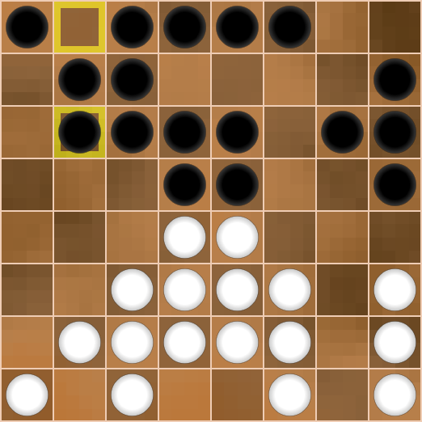

Black is harassing his opponent on both flanks. I am intimidating Tony by capturing the h4 square, but I am actually planning an attack on the other flank.  

**10.h2h4	 d8a5**  
**11.b2a3    ...**  

Diagr. 4
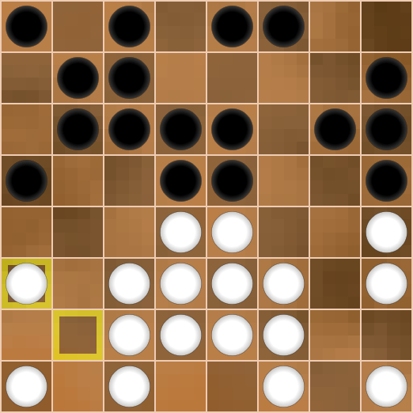

Here, I planned to play b7a6 and a6a4, but suddenly saw the exchange a3b4.  
Thanks to the stronghold d4 White would use this kind of exchange to extinguish Black's initiative in this part of the board.  
At the time, this discovery became a complete surprise to me, and I regretted that I had engaged in a closed game with Tony (6...d7e6).
Initially, I considered disrupting White's centre with e6f5, but it would be quickly restored. Therefore, I decided to accumulate my forces on the flank.

**11...		c7c5**  
**12.c2b3   e8d7**  
**13.d2b4!?	...**

Diagr. 5  
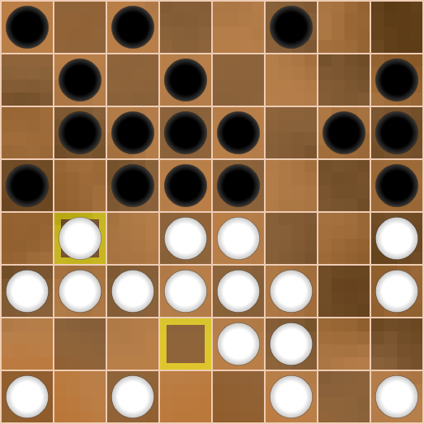

Tony is provoking me to invade the light squares, but could this really be advantageous for him?   
I have a choice: to capture the c4 square in three ways or to abandon it completely.   
It is important to note that invading the c4 square leads to an attack on two pieces, not just one!  

**Option 1**  

It immediately became clear that it is bad to play e6c4, since after the exchanges, the d6 checker is distracted, and Black ultimately remains without a checker.  
I suggest that the reader verify this in his mind.  

**Option 2**  

The move c6c4 also leads to material losses for Black due to the simple b3a4. I didn't want to look for salvation in a panic later, so I focused on the third continuation.  
     
**Option 3**  

   *13...        d5c4*  
   *14.b3a4      c4:c2*  
   *15.c1:c3!    ...*  

   Diagr. 6  
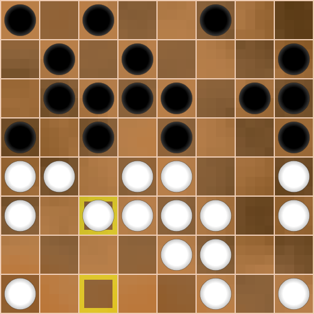

   I planned to respond to the attack on the a5 piece with a counterattack on the b4 piece by moving b7b5 or d7b5.  
   However, it quickly became clear that after exchanging the pieces on a5 and b4, White uses the weakness of the d5 square and plays d3d5, achieving a winning position.  
   I suggest the reader see it in his imagination, and below I will give the following variant:

   *15...       b7b5?*  
   *16.a4:a6    b5:b3*  
   *17.d3d5     b3:d3*  
   *18.d5:b7    d3:d5*  

   Diagr. 7  

   White gets the king and wins.  
   Move 15...d7b5 is slightly better, but still leads to material losses due to the d3d5 manoeuvre described above.  

   However, from Diagram 6, Black has a simple answer:

   *15...       b7a6*  

   Diagr. 8  

   I did not see any dangerous continuation in this case, but I did not like my position.  
   Indeed, the weakness of the b7, b5 and d5 squares should become apparent from the logic of the game.  
   A player must have intuition, an animal instinct that signals him what to do and what is dangerous, where he can go and where he cannot.  
   This quality must be highly developed, otherwise it is impossible to become a good player in any game.  
   I was frightened by the move f3d5 and refused to go for this whole Option 3.  

   I returned to this only in my analysis, without even suspecting what awaited me.  

   *16.f3d5     c6b5*  
   *17.d5:f5    b5:b3*  

   Diagr. 9  
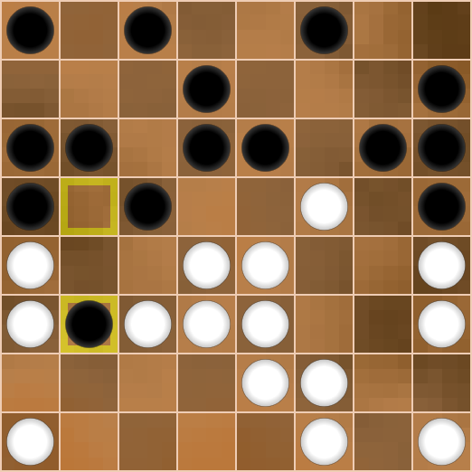

   The combination I discovered for White in this position made a stunning impression on me!  
   Let's consider all the stages of my reasoning so that the reader can follow the course of my thoughts.  
   The black pawn on b3 looks formidable, but on the other hand, White can use it. We immediately see the move d3d5 with the idea of d5:b7, but unfortunately for us, Black does not play b3:f3, but c5:g5.  
   This fact is very annoying, but we continue to dig deeper.  

   The unexpected move of the b3 checker to f3 provides excellent starting opportunities for the white f2 checker.  
   Let us keep this in mind.  
   Next, the f2 checker can only jump on dark squares, therefore, the opponent's checkers must be on light squares.  
   Which checkers are these?  
   Firstly, it is the checker on the f3 square, whose route we have planned in advance, which is b3:f3.  
   Secondly, it is the checker on the f5 or g4 square. No black checker can land on the f5 square, but it can get to the g4 square!  
   Therefore, White can play h4g5 to build a route for the f2 checker, which can capture the f3 and g4 checkers and land on the h4 square.  
   Thirdly, we can extend this route by knocking out the h6 checker via f5g6!  
   
   But, in my euphoria over this idea, I didn't notice the pitfalls.  

   *18.h4g5!!     g6:g4*  
   *19.f5g6!      h6:f6*  

   Diagr. 10  

   But here I suddenly saw that the planned continuation

   *20.d3d5       b3:f3*  
   *21.f2:h8      c5:g1*  

   leads to a response strike from Black 21... c5:g1!

   There arises a complex king ending with mutual chances, despite Black's extra piece.  
   But it is not the goal that White was pursuing!  

   What should White do in diagram 10?  
   Don't despair, believe in your plan!  

   *20.d3f5!!     b3:d5*  
   *21.f5:f7      f8:f6*  

   Diagr. 11  
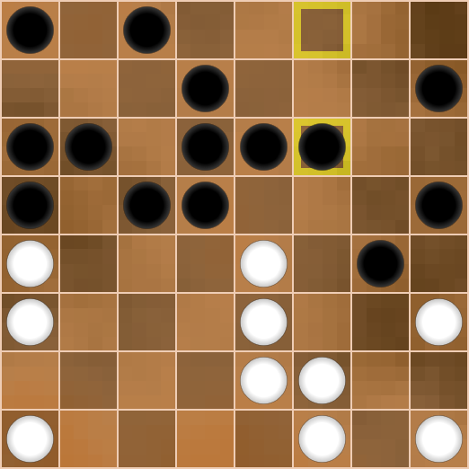

   *22.e3d4       d5:d3*  
   *23.e2e3       d3:f3*  

   However much Black resisted, the b3 piece still got to the f3 square!  

   *24.f2:h8      ...*  

   Diagr. 12  
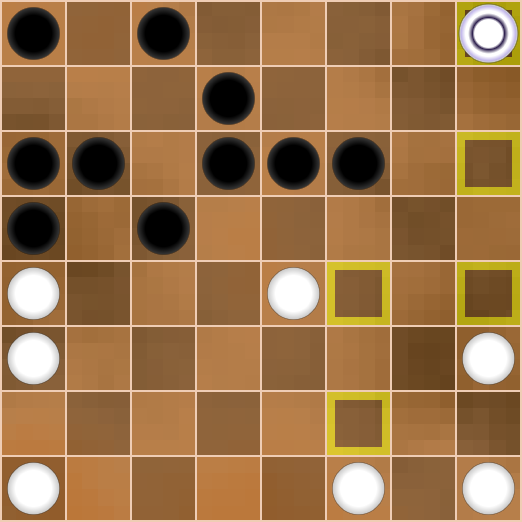

   What a remarkable situation!
   The white king is almost trapped, it's Black's move, but... the king cannot be captured!  

   Black has three pieces against the king, but only White has a great chance of winning.  
   All of Black's pieces are on their own half of the board, and their path is very long and dangerous.   
   The white king is mobile, the first horizontal is well defended, and the piece on h3 is a potential second king.  

   There are, of course, many moves in this position, so below I give an illustrative variant that shows the insurmountable dangers for Black:  

   *24...      c8f5* (What else can be done? Is there a better move?)  
   *25.h3g4    ...*  

   White wants to get a second king and prevents the invasion on f4 because of h8h2.   
   
   TODO: Couldn't black take the other way after h8h2, playing f4:d4 instead of f4:h4 ?

   In case of a careless h3h4, Black had the answer d7g4.  

   *25...      c5c4*  
   *26.g4h5    ...* (Threatens h5g6)  
   *26...      f6g5*  

   Diagr. 13  
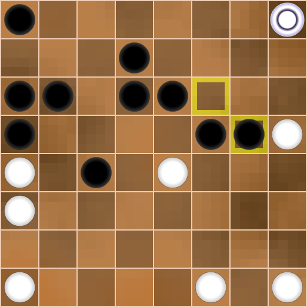

   *27.h5h6    d7g4*  
   *28.h6g7    g5g3*  
   *29.g7f8    g3h2*  

   Diagr. 14  

   Using the majority rule, Black still gets the king, but it's immediately captured.  

   *30.f8:h4   h2g1*  
   *31.h8h5    g1:e5*  
   *32.h4:b8   a8:c8*  
   *33.h5:a8*, 2:0.  

   Of course, this is only one variant, but it reveals some of the possibilities of the sides.  
   Everything shown above does not exhaust the numerous possibilities of the sides.  

   It is my deep conviction that Dameo is an element that is out of human control. At the time of writing (2025), only the player Busybee may have tamed this element.  
   Each new generation produces its own geniuses, and perhaps in 50-100 years, all the secrets of Dameo will be finally revealed, and players will be able to calculate a colossal number of options.  
   But for now, we are like the explorers of the Columbus era, only on a small board.  

   Well... let's go back to diagram 5.  

   Diagr. 5

   **13...     b7a6**  

   Black decided to patch up the holes in the light fields, agreeing to completely close the flank.  
   Now, after 14.b3b5 c8b7, I planned to build a column along the “a” line and, with the help of the exchange a5a4, invade my opponent's camp.  

   But Tony played more cautiously. He decided to go into a solid defense on his left flank and punish me for some “overdevelopment”.  

   **14.e2c4   d7b5**  
   **15.a1a2   ...**  

   Diagr. 15  

   Black removed the checker from square d7, with a potential diagonal attack d6f4 in mind.  
   However, Tony correctly assessed that this attack was now bad, since afterward White responds with its own attack and lands on square b7.

   *15...      d6f4?*
   *16.d4:f6   f4:d2*
   *17.b3d5    b5:d3*
   *18.d5:b7   ...*
   
   Therefore, I am in no hurry and simply capture space, while Tony closes the d2 square just in case.  

   **15...     a6a4**  
   **16.c1d2   f8g7**  
   **17.f2g3   a8a7**  
   **18.f1g2   ...**  

   Diagr. 16
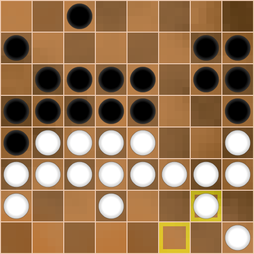

   The tension of the struggle grows with every move, and the price of a mistake is too high.  
   I had no desire to meticulously calculate the remaining tempos, but I had already come to terms with this task.   
   Suddenly... f1g2.   
   Here I wrote to Tony that I couldn't play calmly anymore and wanted to blow up this position, which reminded me of a hellish boiler.  
   Tony replied, “Go ahead, and welcome to hell!”  

   **18...        d6f4**  

   This move and all subsequent hits should have led to Black's defeat, but it was impossible to foresee this.  

   The essence of this move is to clear the way for the checker ...a4!  

   **19.d4:f6     f4:h2**  
   **20.e4:e6     ...**  

   Diagr. 17  
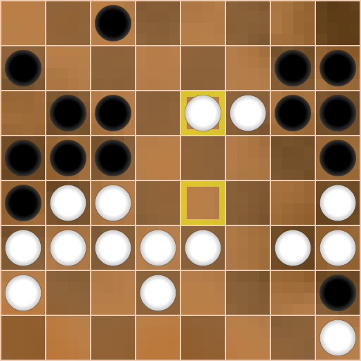

   Now comes the second diagonal strike, but... not right away!  

   **20...        g6f5**  
   
   Can you imagine with how much inspiration such moves are made!  
   I couldn't allow the move f6e7, after which it would be impossible to stop the avalanche of white checkers.   

   **21.f6:f4     b6d4**  
   **22.b4:d6     d4:b2**  
   **23.a2:c2     a4:a2**  

   Diagr. 18  

    
   I understood at that moment that sacrificing two pieces was most likely incorrect, but I didn't see any refutation.  
   It was important for me to get a non-standard position that suited my style better than Tony's.  
   Well... I got what I wanted and expected a straightforward and obvious continuation from White:

   *24.d6e7?      a2a1* (this is stronger than h5g4 & g7g6)  
   *25.e6e8       h2g1!*  

   Diagr. 19  

   *26.e8:a4      g1:e2!*  
   *27.d2:f2      a1:f1* , 0:2.  

   I remained in euphoria of my plan for many years, until I began to analyse this position.  
   Unfortunately for me, White has a clear win, which proves that my idea to blow up the position had a flaw. But since I put beauty in Dameo above all, I was not too upset, because White's win is no less beautiful and original than Black's previous game.   
   
   TODO: The phrase "Black's previous game" might be confusing for some readers; is it GAME №2?

   I suggest readers look for the refutation themselves, and then see it below.

   Diagr. 18

   *24.h4g5!!     h5:f3*  

   Not every player will see this sacrifice.  
   White uses the position of the piece on h2 to its benefit!  
   Material balance has been restored, but now White knows Black's next two moves and therefore has two tempos!  
   There is no defence against this.  

   *25.d6e7       h2:h4*  
   *26.e6e8       f3:h3*  
   *27.e8:a1      h7h5*  

   Diagr. 20

   The White position is, of course, won. It is quite enough to simply play  

   *28.e7f8       h3h2*  
   *29.h1:h3      h4:h2*  
   *30.f8f1       ...*
   
   2:0.  

   Perhaps that would have been a beautiful ending to the game.  
   Not all creative ideas can lead to brilliant victories, like not every artist's work can become a world masterpiece.  

   What happened in our game with Tony next?  

   Diagr. 18 

   **24.g3e5?     ...**  

   I cannot blame Tony for this move, because many players would have made a mistake in this unusual position.  
   White wants to comfortably conduct an attack and get many kings, but it wastes precious time.   
   Tony planned to distract my c8 checker with the sacrifice d6c7 so that his future king would not be captured.  

   **24...        h5g4**  

   Of course, I could have got the king straight away, but I didn't know which square to do it on (a1 or b1), so I made an unexpected move on the other flank.   
   At this point, my opponent decided not to waste any time and rushed to the last horizontal, sacrificing a checker.  

   **25.e5e7      g4:e2**  
   **26.d2:f2     a2b1**  

   Diagr. 21  

   Tony, of course, saw that I was capturing his king after 27.e6e8 b1a1, so he instantly played  

   **27.d6c7      c8:c6**  
   **28.e6e8      ...**  

   Diagr. 22  
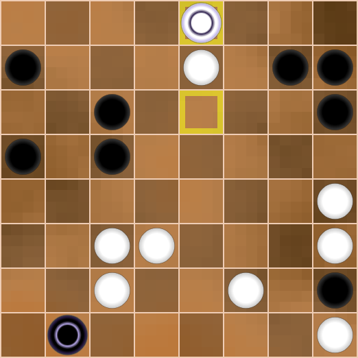

   If White had gotten a second king without any trouble, it could have turned the game around in its favor again, but I placed my king on the b1 square not by chance.  

   **29...        c5d4!**  
   **30.d3:d5     c6c5**  
   **31.d5:b5     b1:b8:f8:f1**  
   **32.e7d8      h2g1**  

   Diagr. 23  
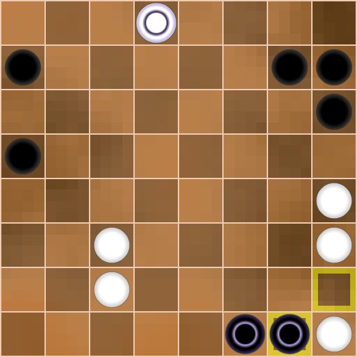

   The storm swept through, taking all of the Whites' hopes with it.  
   But the dream of the h2 checker to become king has come true!  

   Black has won the position in any case, because the two black kings tear White to bits.   
   Tony played  

   **33.c2c4      ...**  

   The move d8h8 prolonged the resistance, but did not save the game.  

   **33...        a5b4**  
   **34.c4:a4     g1g3**  

   0:2.  

   What conclusions can be made from our meeting?  
   I rashly went for a closed game and had to open up a position that I didn't like.  I gave up two pieces, but got chaos on the board, as I wanted.  
   Starting with 18...d6f4, I couldn't foresee  the counter-combination 24.h4g5, because I'm still just a regular self-taught player, not a grandmaster :).   
   Tony had the opportunity to punish me, but he was confused by the wild position and solved the problems in the usual positional way, when extraordinary actions were required.  
   In positional aspect, Tony looked better than me, but in tactical aspect I was stronger, and this ultimately brought me victory.  
