<link rel="stylesheet" type="text/css" href="styles.css">

## GAME №6
Kirin vs Beginner_2017
littlegolem.net
Tournament: draughts.cv.DAMEO.19.1.1
2024

Game URL:
[https://www.littlegolem.net/jsp/game/game.jsp?gid=2455061&nmove=0](https://www.littlegolem.net/jsp/game/game.jsp?gid=2455061&nmove=0)

A short but eventful game against the rapidly progressing Kirin.
I remember our meeting well, as it was like a fencing exchange of jabs, initiated by Kirin himself.
At one point, the price of a move skyrocketed, and the question arose: will the players be able to cope with the rapidly increasing difficulties?
It's a pity that the visible part of the game is 10 times smaller than the hidden one.
However, there is a certain charm in this, because to get to the pearls, you have to dive very deep...

**1.e1g3       g8h7**
**2.f2h4       g7h6**
**3.g1g4       h6g5**
**4.g4:g6      f6:h6**

Diagr. 1
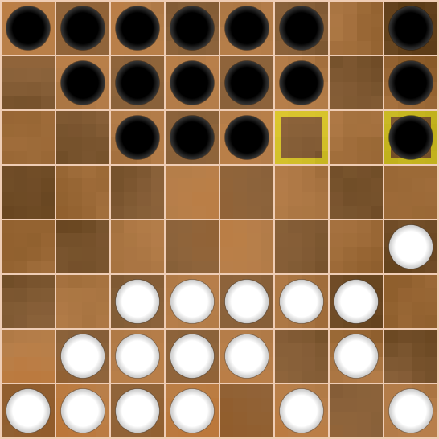

From the very first moves, Kirin showed his aggressive intentions on the right flank, but Black calmly met this pressure.
The battle is just beginning.

**5.g2h3       h7h5**
**6.d1g4       b8b6**
**7.b1b3       d8a5**
**8.b2a3       b7a6**

Diagr. 2
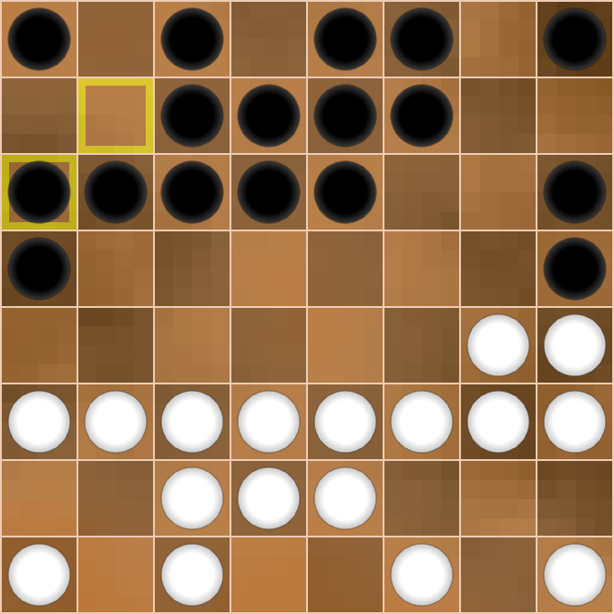

At that moment, I was sure that my opponent will play 9.c2a4, and we will both be forced to fight in a closed position.
I didn't really like this prospect, although I was optimistic about the future, given White's overdeveloped position (before the move c2a4, White is already three moves ahead of Black!).
Usually, this leads to a symmetrical closed position where White has to initiate the attack first, but this often comes at the cost of weakening its own position.
However, these are all rather general considerations; in practice, the game sometimes turns out differently...

**9.d3c4!?       ...**

To be honest, this move discouraged me. I couldn't understand the meaning of this manoeuvre.
However, this move was made by a strong player who had already proven his level many times.
It turns out that Kirin had already planned a strike that I didn't even suspect!
Seeing no danger, I played

**9...          c6b5**

and wanted to move this checker to the a4 square, creating a column of a6-a5-a4.

However, Kirin answered

**10.c2a4       b6b4**

Diagr. 3
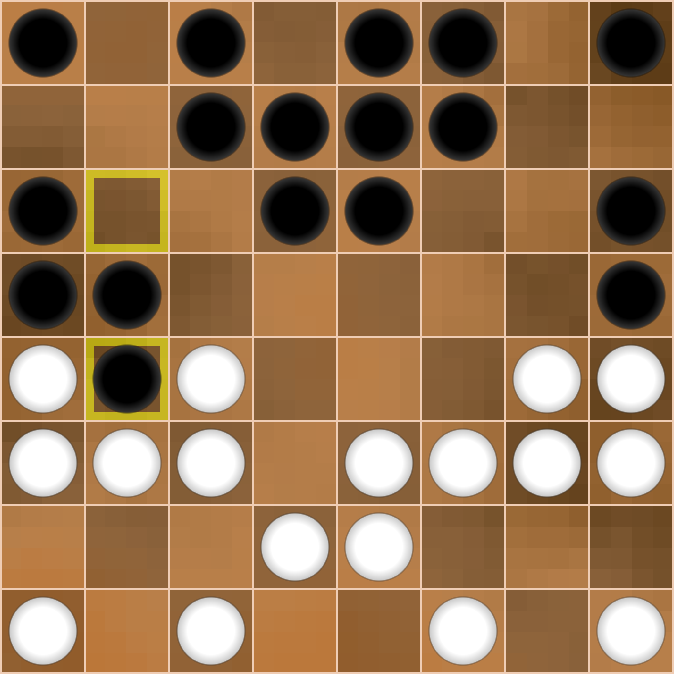

My opponent's play surprised me greatly, and I thought that White simply hadn't noticed the loss of the checker.
I had already mentally awarded myself the victory when suddenly...

**11.c4d5!     b4:b2**
**12.e3f4!     d6:d4**
**13.h4g5      h5:f5**
**14.f4:b8     a8:c8**

Diagr. 4
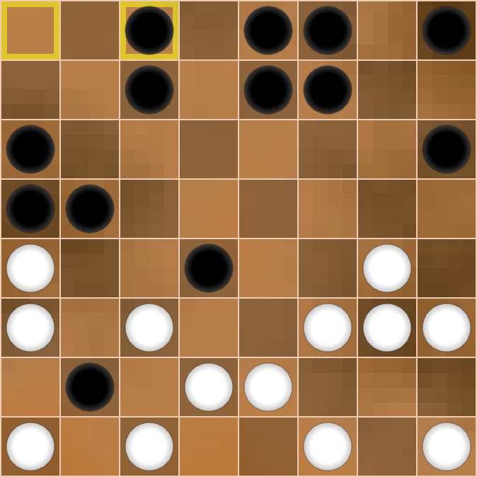

If we were playing by Russian draughts rules, the white king would continue its triumphant march to square b1 without stopping at square b8.
Who would have thought that Kirin will find a weak spot in Black's position (the d8 square) and use this circumstance?
Despite material equality, Black has an isolated d4 that must be defended, and has also lost the important a8-corner piece.
The checker b2 is exchanged. However, it's not so simple for White...

**15.c1c2      b2c1**

Diagr. 5
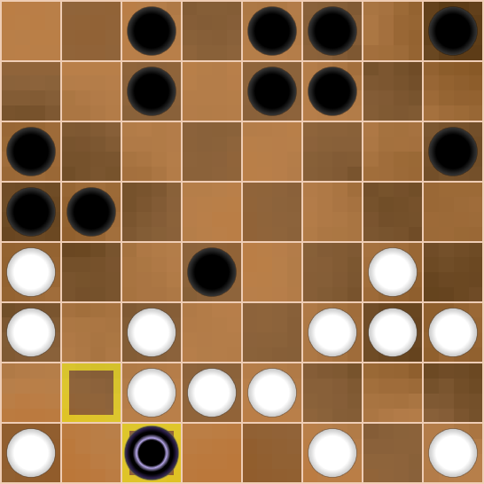

Who would have thought that this position would later, during analysis, astound me with its depth and the highest responsibility for every move on both sides?
So, White needs to make some move before destroying the black king.
But what move is that?
It is interesting if the reader sees the main combinational idea of Black?
Let's call it THREAT No. 1.
This idea will come to fruition in case of a neutral move by White, such as h3h4, f3f4, a1a2, etc.
If you don't immediately see the THREAT No. 1, let's figure out the position together.

White has three logical continuations preventing THREAT No. 1: e2d3, e2e3, and g3g5.
Why other moves are unsatisfactory will be shown below.

### Continuation e2d3

*16.e2d3?!      c1:g1*
*17.h1:f1       ...*

Diagr. 6
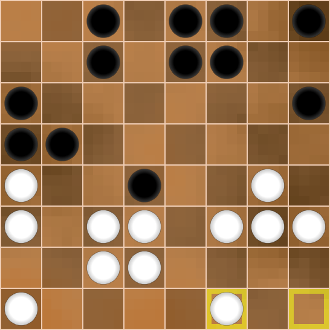

The central black checker seems to have nowhere to go, but Black knows White's next move (d3:d5).
Now look closely. The white checker moves to the d5 square. If we mentally move the c3 checker to the c4 square, we see a perfect path for the future black king: e5-c5-c3-c1.
To do this, we need to move the g4 checker to e6!
So, we see the motive for the attack, but how can we move the checker from c3 to c4?
It's impossible! That's right, but we will move the checker from a4 to c4, and remove the checker from c3 by sacrifice.

*17...          f7f6!!*
*18.d3:d5       b5c4!!*
*19.c3:c5       a5b4!*
*20.a4:c4       a6b5*
*21.c5:a5       h6g5*
*22.g4:e6       e7:c1*

Diagr. 7
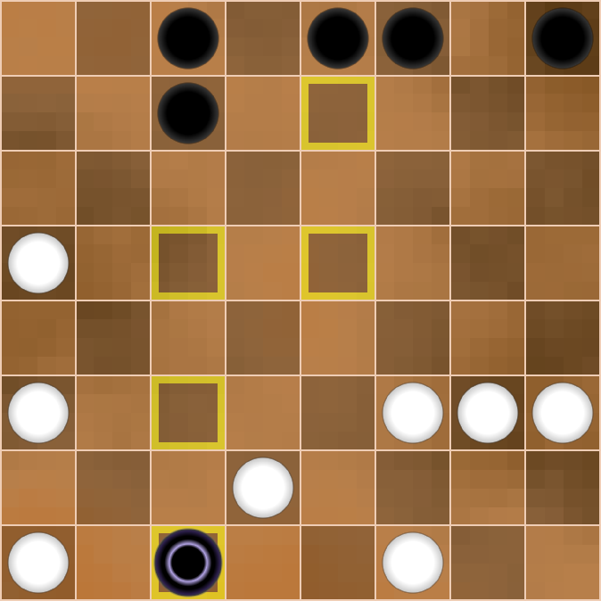

As you can see, anything is possible in Dameo!

Although White has three checkers for the king, only Black has a chance of winning here.
The following variation illustrates the danger for White:

*23.f1e2!       ...*

This is the best move, otherwise the response c1b2 would win immediately.

*23...          c7b6!*

Now the force of the potential column on the vertical “a” is reduced to zero.
In addition, c1c7 & b6b5 are possible threats.

*24.g3h4!       c8b7*
*25.a5a6        ...*

Now, in the case of с1c8??, the black king is captured!

*25...          b7b5*
*26.a6:c6       c1:c8*

Diagr. 8
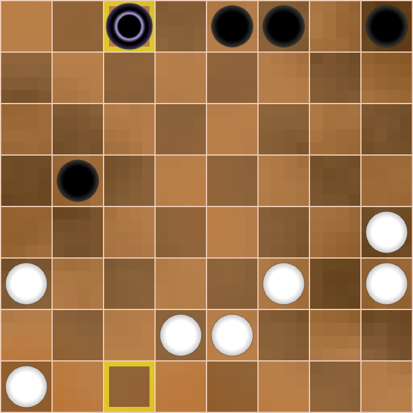

The task of the b5 piece is to distract as many of White's forces as possible, because White cannot allow Black to get a second king.

*27.e2g4        b5b4*
*28.d2d3        c8d8!*

This quiet attack solves the matter.

*29.f3h5        d8:d1*
*30.h3h6        d1d7*

Diagr. 9
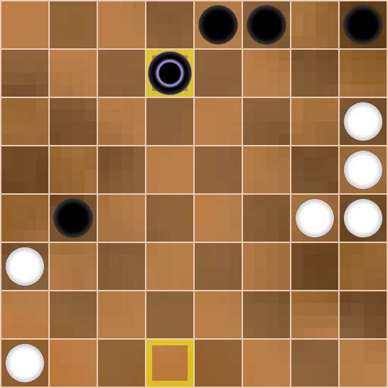

0:2.

Diagr. 5

### Continuation e2e3

*16.e2e3        c1:g1*
*17.h1:f1       ...*

This move is stronger.
The position is so complex that it cannot be accurately assessed.
But it should be emphasised that White has a more difficult game than Black.
Let's demonstrate this using a 20-move variation. At the same time, we will learn many nuances.

*17...          e8e6!*

Diagr. 10
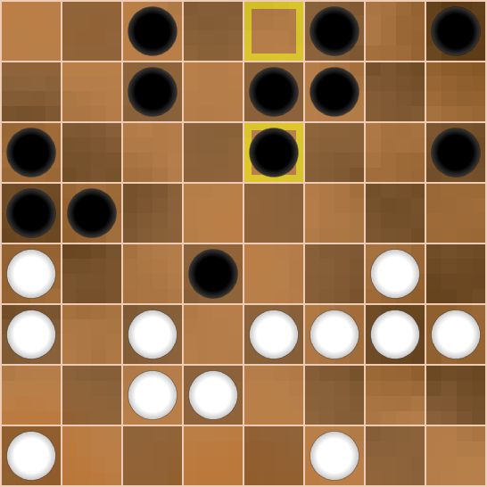

White's weak rear creates quite a few problems.
Now Black threatens to break through to the с2 square: b5c4 - d4c3 - f7d5.

Exchanging the active piece d4 by 18.c3c4 d4:b4 19.a4:c4 a6a4 20.a1a2 c7b6 leads to a significant weakening of White's left flank and complicates the defence.
Black's attack along the ‘a’ and ‘b’ lines is very promising.

*18.f1e2!       f7d5*

Threatens to invade on d3.
The response 19.e2d3? is not a defence, because 19... b5c4! 20.c3:e5 e6:e2, and Black wins. See for yourself.

*19.c2d3        e7e5*

Diagr. 11
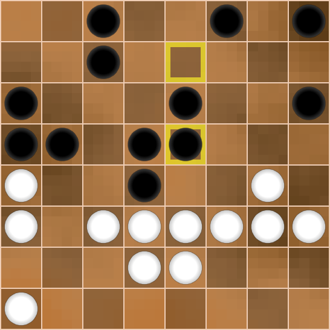

It is important to understand that both opponents have very weak left flanks.
Black can break through with c8c6 - b5c4 - c4b3.
White does not have time to organise a defence in this area, so White rushes into a counterattack on the opposite flank.

*20.h3h4!       c8c6*
*21.f3h5        h8h7*
*22.g3g5        f8g7!*

Diagr. 12
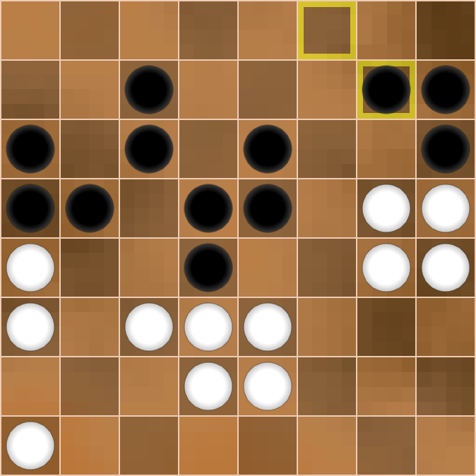

The White attack is also very dangerous; now the white pieces will try to break through the wall.

*23.g4g6        h6:f6*
*24.g5h6        h7g6*
*25.h4h7        ...*

Diagr. 13
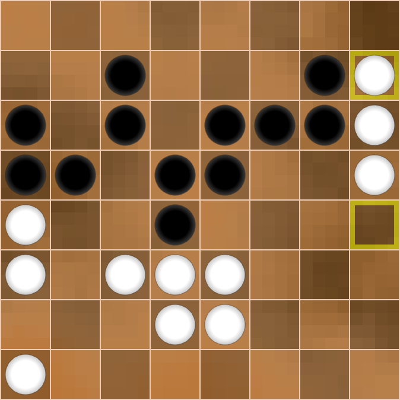

It seems that White has gained the upper hand over Black in the attack, but suddenly comes an impressive strike!

*25...          e6e4!!*
*26.h7:f5       e5:g5*
*27.e3:с5       c6:c2*

Diagr. 14
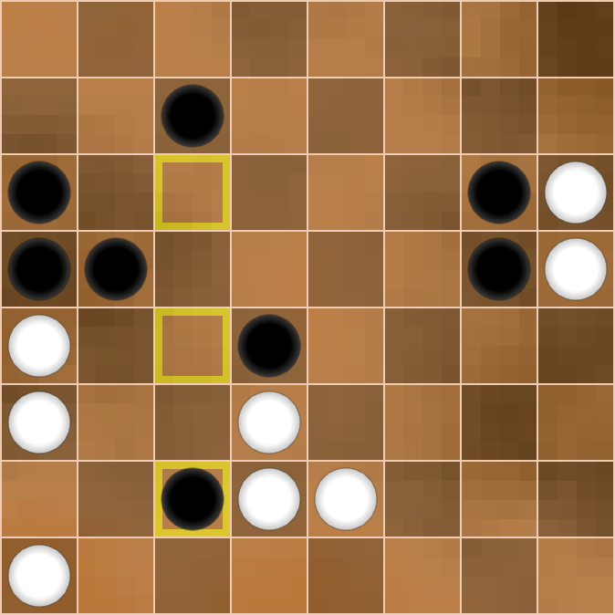

White has four capture options, but none of them are promising.

- 28.d3:d5 c2d1 29.h5:f5 d1:d6 30.h6:f6 d6:g6, 0:2.
- 28.h5:f5 c2d1 29.h6:f6 b5c4 30.d3:d5 d1:g6, 0:2.
- 28.h6:f6 c2d1 and then as in the previous line, 0:2.

*28.d2:b2       d4:f2*

This is the most persistent capture, but even it cannot save White.

*29.h6:f6       f2g1!*
*30.h5:f5       g1g7*

Diagr. 15
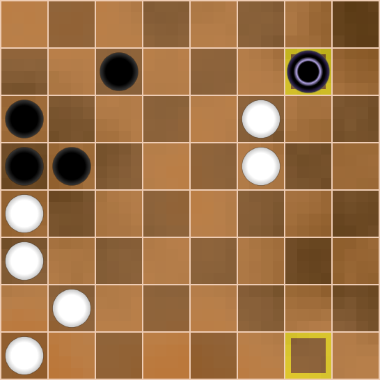

Breaking through to the 8th rank and getting the king will cost White material sacrifices, which will not allow White to achieve a draw.
Immediately loses 31.f5g6 g7:a2 32.f6g7 b5b4, 0:2.

*31.b2c3!        ...*

White does not give up and tries to capture the black king.

*31...          g7h7*
*32.f5g6        ...*

White has captured the g6 square and is threatening to get the king at the cost of a single piece, but Black is preventing this.

*32...          c7d6*

Now getting the king costs two checkers (after f6g7), and this leads to Black's victory.

*33.c3d4        d6e5*
*34.a1a2        ...*

Diagr. 16
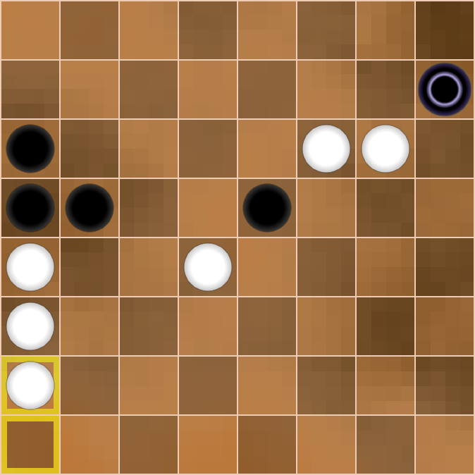

White makes a spare move and forces Black to give up the e5 square.
After that, the d4 checker moves to e7, distracting the black king.
But will this save White?

*34...          e5f4*
*35.d4e5        f4f3*
*36.e5e6        f3g2*
*37.e6e7        h7:a7*
*38.g6h7        g2h1*

Diagr.17
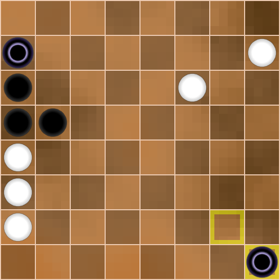

0:2.

After 39.h7h8 a7h7, Black occupies the 7th horizontal and wins immediately.
After 39.h7g8 h1h8 the white king is captured, and Black manages to block the f6 check on the h8 square.
At this point, White fails to break through on the left flank.
Try to evaluate the position in your mind.

Diagr. 5

### Continuation g3g5

This continuation is another defence against THREAT No. 1 in diagram 5 (I hope you haven't forgotten about it?).

*16.g3g5        c1:g1*
*17.h1:f1       ...*

I call the resulting type of position ‘torn, maximally asymmetrical’.
In this type of position, there are the most possibilities and options for both sides. Analysing them all would be madness!
I will limit myself to at least logical moves, but even then, the reader will feel the abyss into which he will be involved.

By the way, during the game I considered the move g3g5 and looked for a response to it.
White threatens an attack on the right flank with h3h4 - e2h5, etc., so I preferred to counterattack the g5 checker with the move h6h5, giving up the d4 checker in return.
The white d5 checker that appeared after the exchange can be surrounded and attacked.
My reasoning was generally correct, but only on a superficial level.
Let's look at the hidden possibilities for both sides in this extremely confusing continuation.

*17...          h6h5*

The move g5g6 is disadvantageous for White, because after e8e6, the g6 checker will be attacked from the f6 square and will be captured.
Then Black will capture the ‘h’ vertical and get a strong counterattack along this line.

*18.f1d3        h5:f5*
*19.d3:d5       c8c6*

Diagr. 18
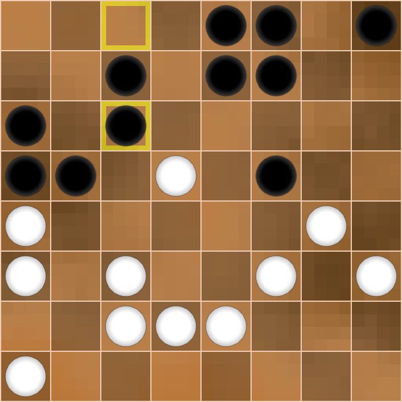

I had reached this point in my mind during the game and decided that White had great difficulty with defending the d5 piece.
However, I didn't even suspect that from this point everything was just beginning!

*20.c2b3!       ...*

White responds by counterattacking on the b6 square!

*20...          c7b6*
*21.d2b4!       ...*

A very cunning move!
White occupies the b4 square with the d2 checker. The c3 checker remains in place.
Why?

*21...          e8d7*

The d5 checker is surrounded, threatening c6c5, but...

*22.c3c4       ...*

Diagr. 19
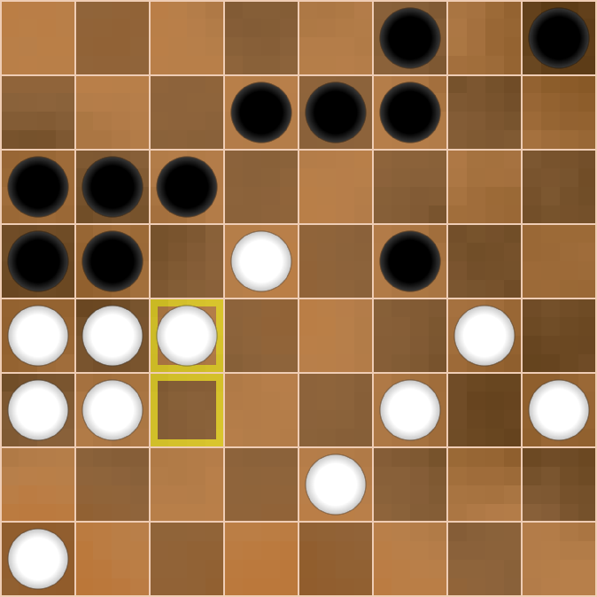

That's why White needed a checker on c3!
Now White can jump a3c5, landing on a7, the g4 checker moves to h7 and is sacrificed, and White gets the a8 king in return.
This is exactly the kind of plans and chains of moves you should think in Dameo.

What should Black do?
Responding with 22...c6c5 is very risky. Let's try to intuitively feel the consequences of this move without calculating the options.
After 22...c6c5, there will be a 3x3 exchange and White will capture vertically ‘a’.
Moreover, 4 (!) white checkers will be able to build a column aimed at the a8 square.
Yes, Black will get a king by breaking through the centre, but I don't think White's attack can be repelled.
I have analysed this 3x3 exchange at length and must say that White's chances of winning are very high.
This analysis is very extensive and would take up a lot of space, but the reader can set up the position on the board and consider this option for themselves.
I would recommend another response that gives Black more opportunities:

*22...          d7d6*
*23.d5:d7       e7:c7*

There is a battle for square c5, but White is ahead of Black.

*24.a3c5!       a5:c3*
*25.c5:a7       c3:c5*

Diagr. 20
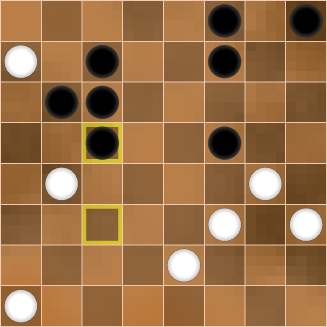

The plans of both sides are clear:
White wants to get the king to square a8/b8, but first needs to sacrifice the piece on square h7;
Black must outpace White in the attack and get the king first by breaking through the centre.
Despite having an extra piece, Black's position is difficult and requires precise play.
White's initiative is very strong and more than compensates for the loss of a piece.

*26.g4h5        b6d4!*

Moving forward with another piece, f5g4, is not a good idea.
Even after the subsequent g4g3, White will push Black back with the sacrifice f3g4 and continue to execute its plan.
Whoever gets the king first will have a better chance of winning.
Therefore, every tempo is expensive.
In addition, Black is looking far into the future and, just in case, is moving the piece b6 away from the attack of the future white king on the square b8.
As you can see, every little detail is important!

*27.h5h6        d4c3*

Unexpectedly, it turns out that if White plays according to plan: 28.h6h7 h8:h6 29.a7a8, then after 29...c6d5 the white king is caught!

*28.a1b2        ...*

Diagr. 21
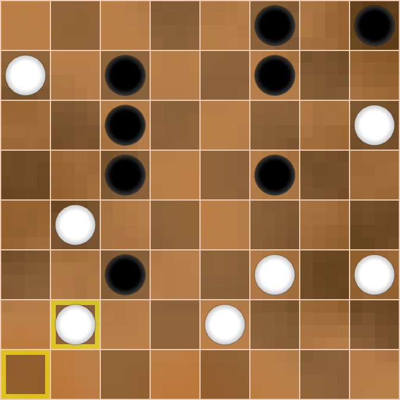

A position arose in which it was time to determine the outcome of the game.

Now Black's active response is beautifully refuted 28...f5e4? 29.h6h7! h8:h6 30.b4b5! c5:a5 31.a7a8,
the white king attacks from all sides, and no tricks can save Black.
See for yourself.

Given this possibility on the part of White, Black should keep the f5 checker in place and constantly threaten to capture the future white king on the field e5.

*28...          c7d6*

Now the above fork by the white king is not possible, because the black checker is on the f5 square, and the king is captured after d6c5 at the end of the variant.
Such nuances constitute this position!
Let us continue.

*29.b4a5        ...*

It is unlikely that White has anything better, as it needs to get the king.

*29...          c6c4*
*30.a5a6        c4c2!*

Please note that it is the c4 checker that is sacrificed, not the c5 checker!
The c5 piece is necessary to control the d5 square.

*31.b2:d2       c3b2*

Diagr. 22
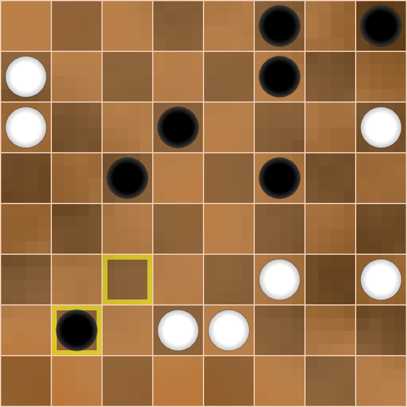

Even just looking at the position, we can feel the tension of the struggle!
It's not good to play 32.a6a8? b2a1 33.a8:g8 a1:a8! 34.g8h7 f7g6 right away, as the game then turns in Black's favour.
Try to scroll all these branches in your mind.

*32.h6h7        h8:h6*
*33.a6a8        d6d5*
*34.a8:e5       d5:f5*
*35.a7a8        b2a1*

Diagr. 23
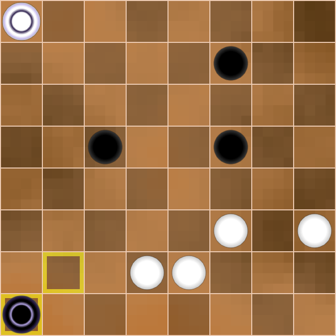

We already know that in Dameo, such endings are extremely sharp and the outcome of the game can be anything.
Right now, White has an extra checker, but Black has a positional advantage thanks to the checker on c5 - it is a potential king.
White must act decisively to avoid losing quickly.

*36.h3g4        c5b4*
*37.a8h8        ...*

It is not good to attack 37.a8f8? a1a8 38.f8:a4 a8:g5 and the black king wins against two simple white pieces.

*37...          b4a3*
*38.e2h5        f7g6*

Diagr. 24
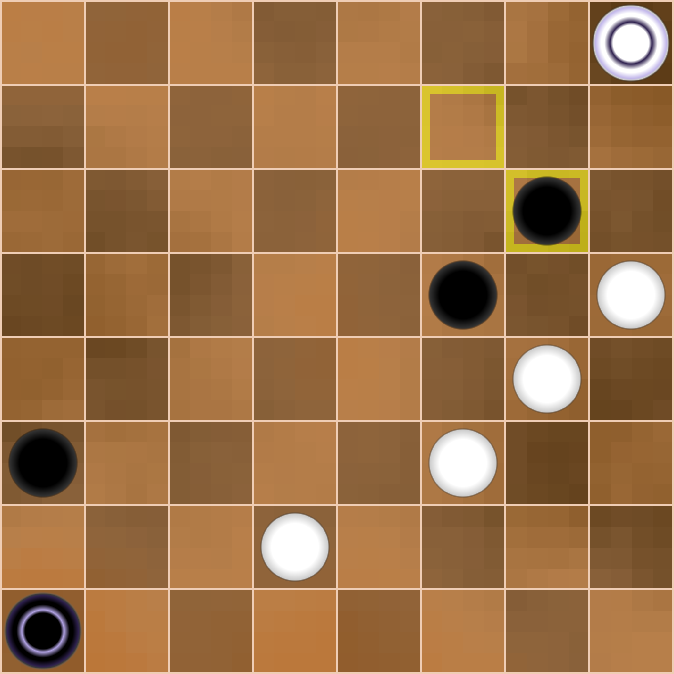

Black cannot allow White to get a second king.
You need to stay careful until the very end.

The move 39.h8g8?? leads to an immediate loss after 39...a3b2.

39.h8h6?? f5f4! 40.h6:a2 a1:g8, 0:2, also loses.

Moreover, it is also bad 39.h5h6? a1d1 40.h6:f4 d1:g7! - Black cuts off the white king's path to square a1. The checker a3 threatens to march to the first row. - 41.h8h1 g7a1 42.f4g5 a3b2, 0:2.

Practice calculating the last option in your head.
With kings in Dameo, you can either win or lose any endgame.

Considering the above options, White should align its pieces so that the black king cannot easily destroy them.

*39.d2e3!       a3b2*

It is still impossible to attack either h8h6 or h8g6 due to the move f5e4!! - 0:2.
Check this again.

*40.h5h6!       ...*

White leaves its king in an impregnable place and attacks with a simple piece.
Remember this mechanism!

*40...          f5e4!*

Diagr. 25
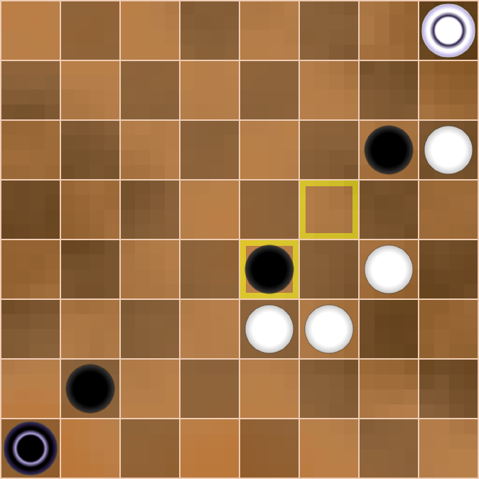

Black is still making its strike!
In the case of a thoughtless response 41.e3:e5?? a1e1 42.h6:f6 e1:a3 Black wins.
You should be alert at all times!

*41.h6:f6        e4:e2*
*42.f6g7         e2f1*

Diagr. 26
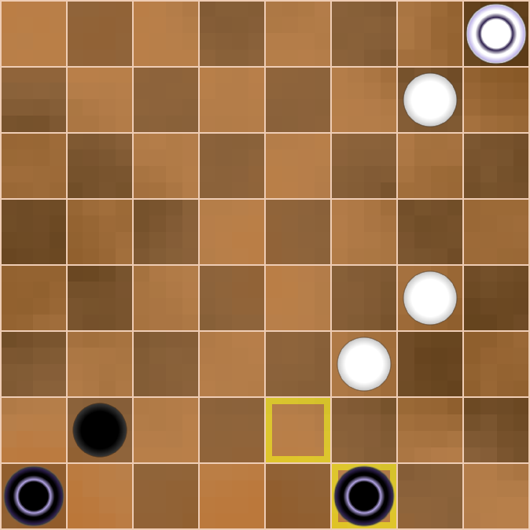

When I began my analysis, I could not have imagined that I would reach this position!
If White immediately wants to have a second king (g7f8 or g7g8), then after the shootout, Black wins again!
Check this without moving the pieces.

*43.f3h5         f1h3!*

A cunning and unexpected move! Black uses its b2 piece in the upcoming skirmish.

Diagr. 27
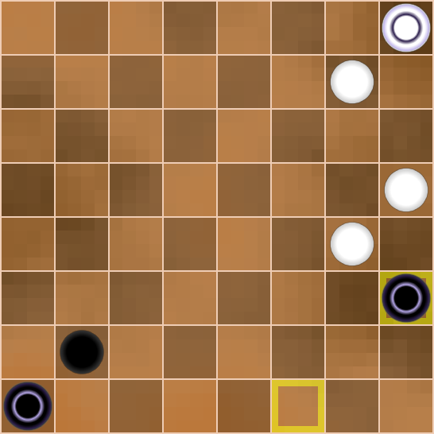

Now White cannot play either g7f8 or g7g8, as after the exchanges both white kings will be lost.
44.h8h6?! b2b1 looks very risky, and the raging black kings threaten to tear apart White's position with moves such as b1b6 and b1g6.

*44.h5g6!        ...*

The only saving answer!
Black knows White's next move in advance, but cannot strengthen its position.

*44...           h3h4*
*45.h8:a2        a1:h7*
*46.g4g5         ...*

Diagr. 28
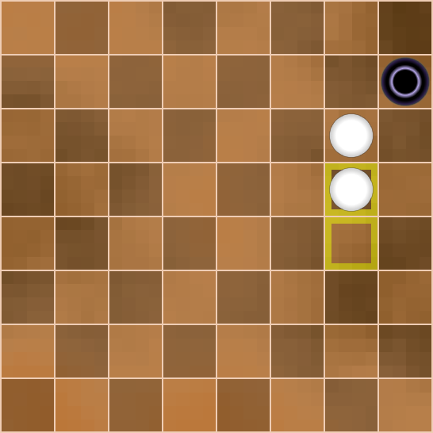

As you can see, it's a draw.
You can play 46... h7h5 47.g5g7 h5h8 or 46... h7g8 47.g5g7 g8h8 - in both cases it's 1:1.

Of course, any advanced computer program can find all this and even more in a short period of time, sorting through millions of moves without the slightest fatigue.
This is an indisputable fact, but I did not set myself the task of embracing the unembraceable.
I am simply presenting some ideas that lurk in these bizarre positions.

Now let's return to the main course of the game.

Diagr. 5

If Kirin had found the move g3g5, I can imagine what a thriller could happen!

**16.a1b2?      ...**

Alas, White stumbles before even entering the thicket of the forest.
Kirin doesn't notice the main threat (remember THREAT No. 1?) and makes a move based on general considerations.
But now we know that asymmetric positions require a concrete approach, otherwise you can burn out very quickly.

**16...         c1:g1**
**17.h1:f1      h6g5!**

Now, I suppose those readers, who haven't seen THREAT No. 1, have seen it.
One white checker is moved to square e6, the other to square e4.

**18.g4:g6      b5b4**
**19.a4:e4      f7f6**
**20.g6:e6      e7:g1**

Diagr. 29
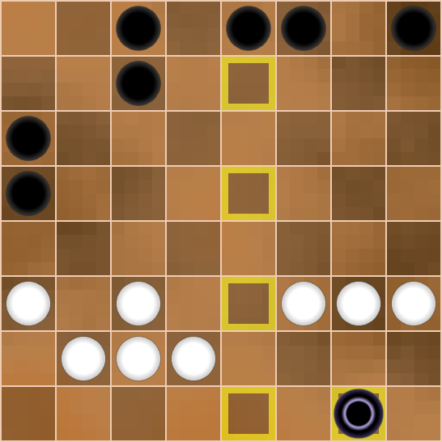

Black's position is won, and there is no great difficulty to prove it.
Kirin still makes a few moves, but the game is already lost.

**21.f3g4       c8c6**
**22.h3f5       g1a7**

It was possible to play 22...a6a4 immediately, but that no longer matters.

**23.g3h4       a6a4**
**24.a3b4       a4:c4**
**25.c3:c5      c6:c4**
**26.g4h5       ...**

Diagr. 30
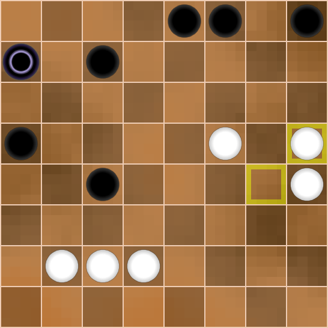

**26...         c4c3**
**27.c2:c4      a5b4**
**28.c4:a4      a7:f7**

0:2.

Well... Kirin and I started fencing with each other, but the thriller came only in the analysis.
This, by the way, often happens in various board games.

Kirin broke the balance and stability in our game first; he was the one who pushed the game into an uncontrollable direction.
It was like rafting down a turbulent, rocky river.
Unfortunately, my partner lost control and capsized.
Fortunately, Kirin is alive and well, and ready to throw himself into these dangerous adventures again and again...
