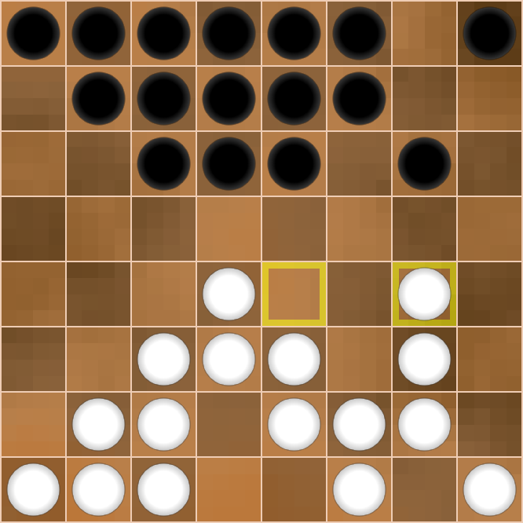
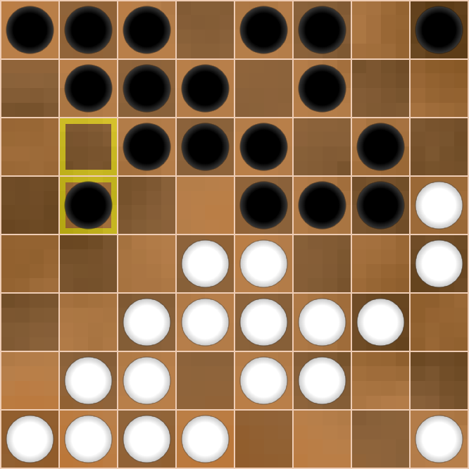
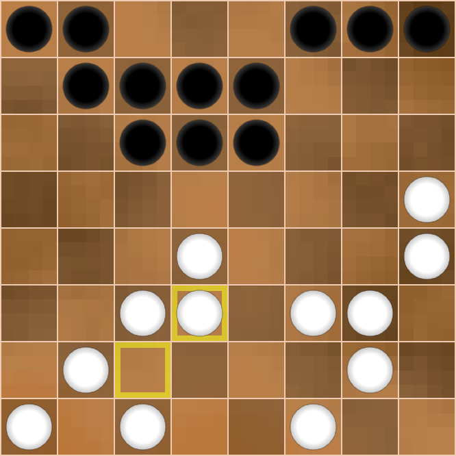
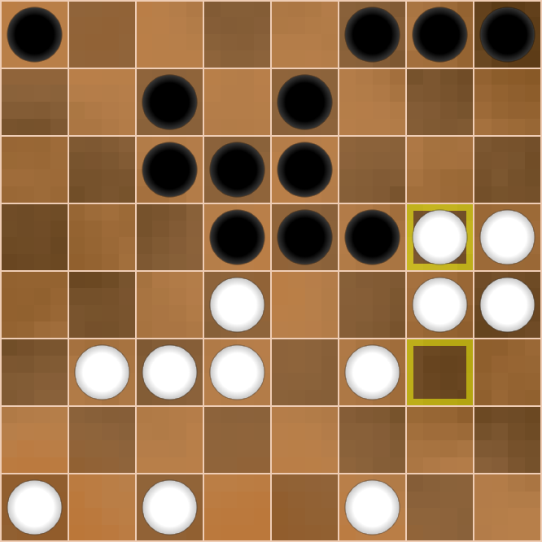

<link rel="stylesheet" type="text/css" href="styles.css">

# Diving Into Dameo
(This is a placeholder title. Edit away!)

This is an example of a specially styled paragraph.

## Introduction

Hello, dear reader!

This book is a sequel to the first book, ‘Meet Dameo!’ That time we got to know
the game, and now we are planning a deeper dive into it.

The idea of the second book is to show the beauty and inexhaustibility of this
game, the intentions and plans of the sides, and the originality of the players'
thinking through examples of whole games or long fragments of them. Consistency
in carrying out the plans of the players and a vivid battle of minds constitute
the beauty of any intellectual game.

It is very difficult to comment on Dameo games because of the huge number of
moves and variants. Only a computer program can handle such a massive amount,
but we are not going to complain and will try to study and understand this
little-explored game more deeply by means of ordinary human manual analysis.

We assume that the reader is already familiar with Dameo's rules, but we will
still briefly describe them. Sufficiently experienced players can skip this
description and proceed to the next chapter.

### Rules

So, the rules of Dameo are to a certain extent the same as the rules of
international draughts, but there are three major differences, namely:

> a) a simple checker moves forward in three directions; a king moves in 8
directions, like a queen in Chess to any available number of cells.

> b) a simple checker may jump over one or more other checkers of its own colour,
provided that the field ahead is free; the king does not participate in a line
jump (red arrows below on the diagram).

> c) all captures in Dameo are straight (orthogonal) only; a simple checker may
capture forward, backward, or sideways by the short leap; a king may capture by
the long leap.

All three differences are shown in diagrams 1a, 1b and 1c.

The rest of the rules (the rule of majority capture, the rule of Turkish strike)
coincide with the rules of international draughts.

1a 

1b 

1c 

An important distinguishing feature of Dameo is the fact that two kings always
defeat a lone king. Due to this, you will win with even a small advantage. This
leads to a high percentage of decisive games compared to international draughts,
which tends to draw in high level play. The construction of the winning position
is shown in the first book in the chapter ‘Two kings against one’.

Well, that's the end of the introductory part and let's move on to the main
content.

## GAME №1  
Beginner_2017 vs Busybee  
littlegolem.net  
Tournament: draughts.cv.DAMEO.16.1.1  
2023

Games against player Busybee are always difficult but memorable. Busybee is probably the strongest Dameo player but he also has outstanding results in other games. For example, Busybee has a 100% win rate in such complex games as Shogi and Lines of Action. It is always nice to come across something unexplainable and genius, because it is an unforgettable experience for us ordinary people.

Our meeting had everything: a very complex opening, inventive play from both sides, nonobvious mistakes and nonobvious punishment for them, and a cascade of combination hits.

|     |        |        |
|-----|--------|--------|
|  1. | e3e4   | g8h7   |
|  2. | g1g3   | h7g6   |

Diagr.1

Black plays ingratiatingly and is not in a hurry. In fact, Busybee made the move g8g6 in two stages. In Chess, such a loss of time often leads to bad consequences in the opening, but Dameo allows you to regulate the pace of your development.

|     |        |        |
|-----|--------|--------|
|  3. | d2d4   |  g7g5  |
|  4. | e1e3   |  d8b6  |

Diagr.2

White also made the move e1e4 in two stages. I just decided to not rush either and see the opponent's intentions. White builds up its forces in the centre and isn't afraid of penetration by the opponent on the field h4:

|     |        |        |
|-----|--------|--------|
| 4.  | ...    | g5h4   |
| 5.  | d1g4   | h4:f4  |
| 6.  | f3:f5  | f6:f4  |
| 7.  | e4:g4  | ...    |

Diagr.3

White has a small advantage in development, as well as 6 pieces against 4 on its right flank. Take note that White removed the black checker f6 to avoid the exchange g6g5. In this case Black would have strengthened on the vertical ‘h’.  
All of the above doesn't mean that White has a clear advantage, just it would be clear and easy for me to play in such a position. Next, I would plan to accumulate forces on verticals ‘g’ and ‘h’, planning an attack and breakthrough on the right flank.  
Again I emphasise that Black's position is quite good, I just like to play with clear guidelines. In this case it is an attack by White's checkers on the right flank.  

Since Busybee refused this variant, I decided to take the h4 field myself.

|     |        |        |
|-----|--------|--------|
| 5.  | f2h4   | e6f5   |

Diagr.4

Possessing excellent combinational vision, Busybee often gives away the edge vertical, but constructs similar fists of checkers and sets endless traps.  
Now it is impossible to go to the field h5 due to the uncomplicated strike:

|     |        |        |
|-----|--------|--------|
| 6.  | h4h5?  | f5g4!  |
| 7.  | h5:f5  | f6:h2  |
| 8.  | g3:g7  | f7:h7  |
| 9.  | h1:h3  | ...    |

Diagr.5

Despite the material equality, White's position is worse due to the weakness of the right flank. Black's attack on the line ‘h’ is very dangerous.  

I decided not to hurry and first closed the field f2.

|     |        |        |
|-----|--------|--------|
| 6.  | f1f2   | e7e6   |

Diagr.6

The position escalates with each move.
Now, when White has already closed the hole f2, I really wanted to play 7.h4h5. Of course, Black has many answers, it's impossible to consider them all, but from a logical point of view there are two continuations.  
Let's consider each of them.

`А)`

|     |        |        |
|-----|--------|--------|
| 7.  | h4h5   | g5f4   |
| 8.  | e4:g4  | g6g5   |
| 9.  | g4:g6  | f6:h4  |

A splinter like that is hard to tolerate, so:  

|     |        |        |
|-----|--------|--------|
| 10. | g2h3   | h4:h2  |
| 11. | h1:h3  | ...    |

Diagr.7

During the game I saw this position in my mind and considered it as favourable for White. Why? I thought that I could continue the attack on the right flank by quickly moving forces there (d1g4, f2h4, e2h5). This plan is clear and understandable, so it's easier to play this way.  
But Black has a second continuation:

`B)`

|     |        |        |
|-----|--------|--------|
| 7.  | h4h5   | g6g4!? |

This answer leads to puzzling complications that are impossible for a human to figure out. Therefore, I didn't risk going for this continuation against a master of combination play like Busybee. What follows is possible:

|     |        |        |
|-----|--------|--------|
| 8.  | g3h4   | g5f4!? |

Diagr.8

In this position the variants are useless, because they are inexhaustible. I feared the binding of my centre by b8e5, and the march of my two pieces on the vertical ‘h’ is broken by the h8 piece. I didn't believe that I would get the king and be able to save it.  
So I decided to prepare more thoroughly an attack on the right extreme line (back to diagram 6).

Diagr.6

|     |        |        |
|-----|--------|--------|
| 7.  | g2h3   | f6e5   |

Black still binds White's centre, but in an unusual way. Obviously, Busybee provokes me, leaving a hole on the f6. But what did he come up with? 

|     |        |        |
|-----|--------|--------|
| 8.  | h3h5   | b6b5?! |

Diagr.9

What? B6b5?? I wasn't expecting this move at all. I would never have come up with it! Despite the sign ‘?!’, the move b6b5 is absolutely grandiose in its plan, but the problem is that I found an unexpected refutation. What is Black's plan against the h4h6 attack?   
Let's see!

|     |        |        |
|-----|--------|--------|
| 9.  | h4h6?  | f5g4!! |

The white checker moves to d5 directly under the bind. 

|     |        |        |
|-----|--------|--------|
| 10. | h5:d5  | g4:g2  |

Black knocks out the pillar of White's position - checker f2.

Diagr.10

Further there are possible insignificant permutations of moves, but we see that after 

|     |        |        |
|-----|--------|--------|
| 11. | h6:f6  | f7:f5  |
| 12. | f2:h2  | b5c4!  |

Diagr.11

Black undermines White's centre, gets material advantage and a won position.  
A crazy combination idea! 
I must confess that during the game I didn't see any of this, but just believed in my opponent.

Suddenly I saw that instead of a reckless attack I could counter-attack and the hunter would become the fowl!  
Let's go back to the diagram 9.

Diagr.9

In Black's position the dark squares are weakened, and it is possible to use this disadvantage with an oblique hit if there is a confrontation of squares in the centre. But where are the squares? If they are not there, we will create them! 

|     |        |        |
|-----|--------|--------|
| 9.  | f2c5!  | b5:d5  |
| 10. | e3c5!  | e5:e1  |
| 11. | c5:g7  | g6:g8  |
| 12. | d1:f1  | ...    |

Diagr.12

Despite the material equality White has an advantage, as Black is behind in development and has no counterplay. Busybee decides to simplify the position by exchanges.  

|     |        |        |
|-----|--------|--------|
| 12. | ...    |  f5f4  |
| 13. | f3:f5  | g5:e5  |

I didn't like the active centre piece e5, so I decided to exchange it.

|     |        |        |
|-----|--------|--------|
| 14. | b1e4   | e5:e3  |
| 15. | d3:f3  | c8e6   |

Diagr.13

I thought that the advantage in development and the twofold superiority in forces on the right flank would give me an excellent chance of victory. This is true, but White's position has one disadvantage: the pieces are still fragmented and, as a consequence, have little interaction. With this in mind, Busybee carries out a plan with a sharp build-up of forces in the centre to attack White's most vulnerable area between the flanks.

|     |        |        |
|-----|--------|--------|
| 16. | h1g2   | e8e7   |
| 17. | c2d3?! | ...    |

Diagr.14

Perhaps, this move loses all the advantage. White closes the hole d3, but opens the field c2, and Black instantly uses it. Better was 17.b2b3.

|     |        |        |
|-----|--------|--------|
| 17. | ...    | d7f5!  |

Now the field g5 is inaccessible for White.

|     |        |        |
|-----|--------|--------|
| 18. | g2g4   | b7d5!  |
| 19. | b2b3   |  ...   |

White finally closes its weak fields on the left flank, but Black makes a capture of the centre.

|     |        |        |
|-----|--------|--------|
| 19. | ...    | b8e5   |
| 20. | g3g5?  | ...    |

Diagr.15

White decided that it was time to take action after consolidating his forces. I convinced myself that neither e5f4 nor d6f4 is dangerous for me. In addition, c7f4 isn't valid, because at the end of the variant the g5 piece gets on the c7 square with two extra pieces.  

This is true, but the intention to outsmart Busybee in the combination game turned out to be too naive.

|     |        |        |
|-----|--------|--------|
| 20. | ...    | d5c4!! |

Busybee gets rid of his checker, which hinders Black in all variants.

|     |        |        |
|-----|--------|--------|
| 21. | d4:b4  | ...    |

What else to do? Another capture would lead to the loss of a checker and Black's powerful centre position. I won't catch a chance there.

|     |        |        |
|-----|--------|--------|
| 21. | ...    | c7f4   |

When there isn't a d5 piece, this strike is very strong.

|     |        |        |
|-----|--------|--------|
| 22. | g4:e4  | e5:g3  |
| 23. | g5:e5  | e6:e4  |

Diagr.16

Even though there are equal pieces on both sides, Black's position is won as Busybee can get 2 kings. One of them dies in the a1—c1 trap, but the other survives.  
This was clear enough to me, but only a few players know my character. In lost positions I often play the strongest.   
It's easy to play when everything on the board is good for you, but how hard it is to gather yourself at a critical moment and find a chain of the best moves with the faint hope for a draw! Perhaps my innate optimism helps me in this regard. Anyway, out of all the games I won, I had a very bad position in 30% of them.  
So, let's look at the diagram.   
Firstly, we need to prevent Black from getting 2 kings. To do this, we take control of the f3 square.

|     |        |        |
|-----|--------|--------|
| 24. | f1f2!  | g3h2   |
| 25. | c3a5   | ...    |

Secondly, we organise our own counter-play. It is necessary to constantly keep the opponent in suspense.

|     |        |        |
|-----|--------|--------|
| 25. | ...    | e7f6!  |

Diagr.17

Take note of Black's last move. This is a very multidimensional move. Checker f6 goes to help checker e4 to make a breakthrough on the field f3. But why didn't Black play d6e5 for this purpose? Then Busybee would save 1 tempo! But the d6 piece should go to c5 and close the c6 piece if White gets a king on c8. In this case White's king is caught by the way g8h7.  

Given this reasoning, I concluded that it is necessary to attack the black pieces on the last row to destroy the trap for the future king on c8.

|     |        |        |
|-----|--------|--------|
| 26. | h4h6!  | d6c5   |
| 27. | h5h7!  | ...    |

Diagr.18

White fights with all its might! Threatens h6g7, and at any capture White gets a king either on g8 or h8. In this case White's king will attack Black's checkers with tempo! What should Black do?  

The situation seems to be out of control, but Busybee finds a stunning manoeuvre with the sacrifice of 3 checkers! 

|     |        |        |
|-----|--------|--------|
| 27. | ...    | c6b5!! |
| 28. | b4:b6  | f8g7!! |
| 29. | h7:f5  |  h2g1  |

Diagr.19

Crazy position! White has 3 extra checkers and its turn to move, but the black king is stronger than the storm!  
What should White do?  

I realised immediately that it was bad for me:

|     |        |        |
|-----|--------|--------|
| 30. | c1b2 (c1c2) | g1f1! |

0:2.  
Black king from the rear attacks 2 checkers on vertical ‘f’ and then destroys everything in its path.

Doesn't help and loses immediately:

|     |        |        |
|-----|--------|--------|
| 30. | f5e6   | g1:b7  |

0:2, as the black king controls the 7th horizontal, preventing any breakthrough.

For this reason, it's no good:

|     |        |        |
|-----|--------|--------|
| 30. | b3a4   | g1:b7  |
| 31. | a4a6   | b7a7   |

0:2.

A counterpunch for the majority doesn’t help either:

|     |        |        |
|-----|--------|--------|
| 30. | c1d2   | g1f1!  |
| 31. | d2e3   | ...    |

Diagr.20

Original and beautiful, but no more.

|     |        |        |
|-----|--------|--------|
| 31. | ...    | f1:c3  |
| 32. | d3:b3  | e4:e2  |

0:2.

Let's go back to the main diagram 19.

Diagr.19

Being in a desperate situation, White finds the best move.

|     |        |        |
|-----|--------|--------|
| 30. | b3c4!  | ...    |

A sign of ‘!’ for persistence and ingenuity even in this position.

Now, in the case of an erroneous

|     |        |        |
|-----|--------|--------|
| 30. | ...    | c5:e3??|
| 31. | b6c7   | g1:b1  |
| 32. | a1:c1  | e3d2   |
| 33. | c7d8   | d2e1   |

Diagr.21

There are two paths to White's victory here:  

`A)`

|     |        |        |
|-----|--------|--------|
| 34. | h6h7   | e1:a7  |
| 35. | d8e8   | h8:h6  |
| 36. | d8:d4  | ...    |

Then the white king penetrates the h7 square and helps to get the second king, 2:0;

`B)`

|     |        |        |
|-----|--------|--------|
| 34. | f5f6   | e1:g6  |
| 35. | h6:f6  | ...    |

Then White gets a second king and gradually destroys all black pieces, 2:0.  
What a turnaround!

But Busybee takes the king out of the danger zone:

|     |        |        |
|-----|--------|--------|
| 30. | ...    | g1:b7! |
| 31. | c4:c6  | ...    |

Diagr.22

It seems White has some chance of salvation, as it is eventually possible to distract the black king with the sacrifice of a couple of checkers, but look what Busybee has come up with!

|     |        |        |
|-----|--------|--------|
| 31. | ...    | e4f3!! |

Who would think of such a move? Fantastic!

|     |        |        |
|-----|--------|--------|
| 32. | f2:f4  | b7h7!  |

Diagr.23

A rare and beautiful fork. White again has 3 extra pieces, but the position clearly shows the power of the king in Dameo.

|     |        |        |
|-----|--------|--------|
| 33. | d3e4   | ...    |

There's nothing better.

|     |        |        |
|-----|--------|--------|
| 33. | ...    | h7:c7  |

Diagr.24

Black king not only controls the 7th horizontal, but also threatens to win the checker a5 by direct attack from the fields a7, b8, c8, but even now White sets the last trap!

|     |        |        |
|-----|--------|--------|
| 34. | a1b2!  | ...    |

Fortunately, ingenuity didn't leave me and I found the strongest move. 

Now, in the event of a direct attack:

|     |        |        |
|-----|--------|--------|
| 34. | ...    | c7a7?  |
| 35. | a5b6   | a7b8   |
| 36. | b6c7   | ...    |

Black is forced to capture the checker b2, and White gets a king:  

|     |        |        |
|-----|--------|--------|
| 36. | ...    | b8:b1  |
| 37. | c7d8   | ...    |

The fight goes on for a long time, and White's chances increase. 

But Busybee found the right rearrangement of his checkers.

|     |        |        |
|-----|--------|--------|
| 34. | ...    | c7b8!  |
| 35. | b2a3   | a8b7!  |

Diagr.25

Black prepared the sacrifice b7a6 followed by b8a8. White has no defence against it.

|     |        |        |
|-----|--------|--------|
| 36. | a3a4   | b7a6   |
| 37. | a5:a7  | b8a8   |

Diagr.26

White gave up.  
0:2.

Well... Despite losing, I really enjoyed fighting in this game. After all, beauty is above all, and I'm glad that I created it with my partner.

TODO: Split into chapters. When diagram numbers depend on previous values, it makes any insertion or changes very cumbersome.
If an error in the first chapter is discovered after writing 10 chapters, the whole book has to be updated to fix it.
Continuous/global diagram numbers can still be produced in the final compilation if wanted, but each chapter should work on its own.

## GAME №2  
Ray Garrison vs Beginner_2017  
littlegolem.net  
Tournament: draughts.cv.DAMEO.5.1.1  
2018  
  
Sometimes I come across games that are impossible to analyse because of Dameo's infinity. Yes, sure, I can dive deep enough, but the abundance of variants and continuations discourages me.  
Now I'm going to tell you about one of such games, it will be a long story, but I'd like the reader to fully feel that an ordinary 8x8 board can be like a cosmos with infinite stars.  
My meetings at the board with Ray Garrison are often of a memorable character. Ray is a very pleasant partner and conversationalist; he reads a lot and has a deep knowledge. Although I don't know him personally, but only by correspondence, I have a strong feeling that I am talking to a gentleman from the 19th century - well-mannered, tactful and friendly.  
One of our first fights took place in 2018. I had known Dameo for less than a year and tried to experiment a lot. I was still a ‘raw’ player, without style or understanding, but with a huge desire and energy. Having watched a few of Ray's games before this game, I realised that he is a classical style player, preferring reliable structures with traps a1-c1 and h1-f1 against the opponent's king.  
So, I decided to challenge such a strategy…

**1.g1-h2	e7-e5**  
**2.e1-g3	d7-d5**  
**3.b1-a2	g8-h7**  
**4.d2-d4	d8-b6**  
**5.c2-c4	…**

Diagr. 27

I won't dwell on the first moves, as they can be almost any. The main thing is the future plan.  
It was at this point that I decided to take a radical step to try to throw my opponent off his equilibrium by any means.  

**5…    c8a6?!**  
**6. d1g4	f8h6?!**

Diagr. 28

How to comment these moves of Black? Any slightly experienced player will see the obvious disadvantages and criticise it. Indeed, Black is exposing its rear and burning all bridges. Once White gets a king, it will be impossible to catch it on the 8th row.  

However, such a development has a plus: Black has extra checkers in the struggle along the entire clash line. I expected to suppress White by the number of my checkers and supposed that this pressure will compensate all the disadvantages of my decision. For example, Black already has a 5 vs. 3 advantage on verticals ‘a’ and ‘b’.  

This plan, but only in a less radical form, I sometimes apply it now.

**7. a2b3?	b8a7**

The move a2b3 seemed a bit strange to me. On the contrary, playing for White, I would try to block the vertical ‘a’ by e2b5! and c4:a4. But White loses its sense of danger, allowing Black to create an attack on the flank.

**8. h2f4	…** (with the idea of f3f5)  
**8…		e8g6**

Diagr. 29

Picture position!
Black managed to get an advantage on the flanks, and its square d6-e6-e5-d5 holds the defence in the centre.

**9. e2e4	a8a5**  
**10. b2a3	a5a4**  
**11. a3:a5	a6:a4**  
**12. c3b4!?	…**

Diagr. 30

Black consistently carries out its plan and flank attack already looks threatening. Indeed, Black has an advantage in strength (6 vs. 5), as well as freedom for manoeuvres and accumulation of forces. White is constrained and clamped.  

Realising that passive defence is unlikely to be successful, Ray resorts to a desperate measure, risking to lose immediately, but builds a trap...

**12…		c7c5?**

It was played with the wrong piece! Believing that the position is won almost automatically by attacking the checker c4, I played the checker c7. I remember that I was afraid of some penetration on a6 and left my checker on a7.  

But who would have thought that it needed to protect not the a6 field, but the d7!
My move looks very strong, but Ray blasts the position with a landmine hidden in the depths of the board!

**13.d3b5!!	…**

Oh, my God! What is that?  

**13…		с5:с3**  
**14.f3f5!	…**

Where's that coming from? What's happening? I remember I was sitting like I knocked out and didn't understand anything.

**14…		d5:h3**
**15.f5:d7	…**

What's the matter! At checker on c7 White's combination does not work!

**15…		a4:c4**  
**16.d7c8	b6:b4**  
**17.c8:c2	…**

Diagr. 31

Well, an anomalous position has emerged on the board, where Black has four checkers for a king, and also the dangerous checkers a3 and h3. The problem is that White's king is so strong that it doesn't let Black's pieces even move because of constant hits with free tempo. For example, Black attacks a checker, and White sacrifices it on the next move, and in the meantime moves the king to the necessary place. Black is forced to capture the prey, and White's king destroys a large enemy force.  

Now threatens g4g5, so the obvious countermeasure seems to be the move g7g5. Really, Black with a tempo attack white pieces and at the same time threaten to catch the king by b7c6. What else can be demanded from such a strong at first glance solution?  

I noticed a long time ago that in abnormal positions simple logical moves do not lead to the goal, because these kinds of positions require abnormal decisions :).  

It would seem that the most obvious move g7g5, which 95% of players would make, is the best solution, but alas, White has an impressive counter-punch from which goosebumps run down my skin.

So, let's consider:

*17...		g7g5*  
*18.g2g3!!	h3:f5*

Diagr. 32

Here is the free tempo, which the white king has been waiting for! However, if we immediately play next

*19.c2a2? g5:g3*  
*20.a2:e5	…*

the white king will destroy 5 black pieces and will be forced to stop on the field e5, as it is impossible to jump the f5 piece twice. But in this case Black catches the king by f6g5! See here:

*20…       g3h2!*  
*21.h1:h3  f6g5*  
*22.e5:h5  h6:h2*

Diagr. 33

Thanks to the active checkers h2 and b4, Black gets the king first and must win.

Let's go back to the diagram 32. 

As you can see, checker e4 hinders the white king, limiting its mobility. For this reason White should not hurry to use the free tempo, but make an incredible move…

*19.e4e5!!	…*

Diagr. 34

The most amazing thing is that I found this move while playing the game, mulling over the position in my mind! I remember it was on my lunch break at work. I didn't think any more, because White's king gets the greatest opportunities, and I intuitively felt that Black would be bad.  

Next, we'll look at all 3 captures.

Continuation 1.

*19…		g5:g3*  
*20.e5:e5		…*

Diagr. 35

In this position Black must play extremely accurate. It is impossible to consider all continuations, so let's concentrate on the main one.  
What is Black's main idea? To destroy the opponent's king and get its own.

*20...		g3h2!*  
*21.h1:h3	b4c3*  
*22.c2:g6	h6:f6*	

Diagr. 36

The material equality is restored, but the situation is very difficult, a draw is still far away, one extra tempo can solve everything. Now threatens a3b2, so White must close this field.  

I will not tire the reader with unnecessary variants, as variants are harmful if the human brain is not able to perceive them. Let's imagine that we are just playing and in this position we outline a plan of further actions for both sides.  

I propose to play for White 23.a1b2. Why?  
When Black's straightforward attack along the line ‘a’ by b7a6, etc., one of the attacking pieces is exchanged on the c2 field, and the white piece e5 turns into a king faster, takes control of the a8 field, from where it can move to h1. This will be a trap for the black king.  
Black's attack along the h line - h8h6, etc. - seems non-threatening in view of f2g3 & g3h4.
Building an attacking column on line ‘b’ by a7b6 & b7b5 is late, because the white piece e5 is placed by the king earlier on b8.  

Thus, we conclude that Black should avoid mutual races to get the king, because the e5 piece is ahead of the others.  
Consequently, Black must place its checker on the c6 square to prevent the breakthrough of the e5 piece.  

This is roughly how I recommend reasoning, not counting variants.  
Since we can't devote another 10 pages of text to this position, I'll show an illustrative variant with possibilities for both sides.

TODO: Notice the 20.e5:e5 move above. In this variation line, the checker was already
 moved from e4 to e5. Yet white spends a tempo on 24.e4d5 in the below analysis.
 It isn't a possible move, so is the rest of this continuation valid?

*23.a1b2		b7c6*  
*24.e4d5		a7b6*	  
*25.f1f3		b6b5*  
*26.f2f4		b5b4*

Diagr. 37

White wants to break through the centre, and Black plans to sacrifice checker b4.
It is clear that whoever gets the king and the right to move first will win.

*27.f3f5		h8g7*  
*28.f5:f7		g7:e7*	  
*29.f4e5		b4b3*  
*30.b2:b4		a3b2*

Diagr. 38

Even though there is less and less material on the board, the fight is escalating more and more! Yes, that's Dameo's speciality.  
White still has no time for d5e6 because of b2a1, and Black wins. Consequently, White can't let Black get the king with tempo.  
Also, don't forget that ending 2 kings vs 1 is won.

*31.c1c2!	    b2:d2*  
*32.d5e6		e7d6*  
*33.e5e7		d6:f6*  
*34.e7f8		f6e5*   
*35.f8f1		e5d4*	

Diagr. 39

White got the king first and great chances to win. However, Black plans to get to the b2 square and continues to fight!

*36.b4a5		d4c3*  
*37.a5a6		c3b2*  
*38.f1a1		d1e1*  
*39.a1:h1		b2a1*  
*40.a6b7		a1a8*		

Diagr. 40

*41.h3h4!		…*

It seems that White wins after opening the vertical ‘h’. White king gets on the h8 and expels the black king. White gets a second king and must win, because the checker c6 is too slow.  
Black can try not to open the line ‘h’ by means of

*41…			c6b5*  
*42.h4h5		h7g6*,

but then

*43.b7b8		a8:h4*  
*44.h1:b4*, 2:0.

Our analysis began on move 17 and ended on move 44! And this is only the main part, and how many side continuations I had to not describe.  

Of course, I may be wrong and somewhere moves can be strengthened by a hidden manoeuvre for both sides, but let's leave it for the next generations or future computer programs.  

Either way, this continuation №1 leads to an enterprising game for White, and the defence for Black is quite difficult.  

Let's return to the initial diagram № 34 and consider the second capture.

Diagr. 34

It is easy to see that a small movement of a single checker on one field (e4e5) generated a whole ocean of possibilities. So, a faint breeze sometimes becomes a harbinger of a storm.

Continuation 2.

*19…		e6:e4*  
*20.c2a2	g5:g3*  
*21.a2:a5:g5:g7:e7:e3:h3		…*	

Diagr. 35	

According to the majority rule, the latest capture of White is correct.  
This is the kind of capture that scared me during the game, as it is very difficult to resist the mobility of the king. I didn't have the energy or desire to count all the variants, I just realised that I shouldn't go into such a maze.  

Indeed, Black has only 2 pieces for the king and some chances for salvation. Such a perspective is not inspiring. Yes, it is possible to fight, winning for White is not easy at all, but to search for Black chain of the strongest moves without the right to make a mistake is an unpleasant task.  

What can Black do?

*21…			f6g5!*

This move seems to be the real strongest. Black threatens to capture the king (h6h5 or g5h4), hinder the attack with tempo h3a3 because of b4c3 with capture of the king.
As you can see, there are hidden resources even in difficult positions.  

Let's look at the position through the eyes of the White player. In general, White's king is vulnerable to capture on the 3rd row. But White's main task is to get the second king! Only in this case will appear big chances to win. Most likely Black will break through with 4 pieces, therefore White needs to find a defence plan against the onslaught.  

What is this plan?
This is a difficult question, but I suggest the following:  
1.keep the trap a1-c1;  
2.checker f1 should go in counterattack on the 8th horizontal, its goal is to become the king;  
3.checker h1 should stay in place, its task is to break Black's forces or to be exchanged for a potential black king, it is favourable for White.  

This plan isn't bad, but it's not clear if it leads to victory or not. The next variant illustrates the potential for both sides.

*22.h3c3		g5g4* (with idea g4g3 & h6h5)  
*23.c3a3		…*

Diagr. 36

White with tempo attacks checker a7, there is no move b4c3, but it looks very attractive to capture the king by means of

*23…			h8h5*  
*24.a3:a8		b7a6*  
*25.a8:h4		h5:h3*

Diagr. 37

White has two extra pieces, but Black's initiative is very dangerous. Do not break the trap a1-c1! Checker h1 stays in place, and checker f1 goes a long way.

TODO: In my analysis of this continuation, there is already a white checker on f2.

*26.f1f2!		h7h5*  
*27.f2f3		h6h4*  
*28.f3f4		h3g2*  
*29.f4f5		h5h3*  
*30.f5g6		h3f1*  
*31.g6g7		f1:b1*  
*32.a1:c1		…*

Diagr. 38

This ending is a winner for White, for after any 1-for-1 exchange, White gradually gets a second king and catches the lone black king.  

This is a demonstrative variant, emphasising the strength of White's plan. Do not consider the great variety of moves, think in schemes! You have a plan, you carry it out, you have the initiative and often this is enough that variants are in your favour.

Let's go back to diagram 34 again and evaluate the third continuation.

Diagr. 34

Continuation 3.

*19.…		f5:d5*

This continuation is weaker than the previous ones and it's easier for White to get a win.

*20.c2a2	g5:g3*  
*21.a2:a4:e4:e7:g7:g5:b5:b8		…*	

Diagr. 39

There was another route with a get on the a8 field, but it is not principal any more. White has restored the material balance, has a king and a strong first line defence. In addition, after a7b6 the white king is not caught!  

Next, we are still thinking schematically and not counting any long variants.  
I propose to exchange the active black checker g3, after which Black's attack will be ineffective. I'll limit myself to an approximate variant.

*21…			f6g5*  
*22.b8e8		g5h4*  
*23.f1f3		g3:e3*  
*24.e8:e1		…*

Diagr. 40

Each exchange is favourable to White and leads to a win.

*24…			h8h5*  
*25.e1f1		…*

As soon as the black piece gets to the h3 square, it will be exchanged.

*25…			a7a6*  
*26.f2g3!		a6a5*  
*27.g3g4		h4:f4*  
*28.f1:f8*, 2:0.

Diagr. 41

Afterwards White arranges a blockade on the second horizontal and in the point h2, and the checker a5 is easily stopped.  
I purposely do not consider this ending in detail, as such positions need to feel without counting variants.

Thus, we conclude that in the position in diagram 34 White has a good chance to win. If in continuations №1 and 2 Black has some chances to save, then in continuation №3 there are no such chances.

Let's go back to the main flow of the game and to Diagram 31.

Diagr. 31

Of course, I didn't see anything like this during the game, but I found the move 19.e4e5, which gives White wide opportunities. I got scared and refused the method of defence by 17...g7g5.  

But I had to find another line of defence!  
How did I reason? The white king is very strong and to limit it somewhat, I should not create weak fields in my camp, i.e. keep the checker massif compact. Besides, I wanted to keep my a3 and b4 pieces at all costs to scare my opponent with a breakthrough on both flanks.

**17…		h6g5!**

This move is the straw I grasped at when diving to the bottom. Indeed, Black does not weaken the g7 field, maintaining a monolithic mass. Now all the above-mentioned combinations do not work. On top of that, I'm preparing a stealth strike.

**18. g4h5		g7h6!**

An unexpected answer.

**19.h5:f5		h3h2**  
**20.h1:h3		g6g5**  
**21.f5:h5		h6:h2** 

Diagr. 42

Among other things, Black threatens to capture the king after b4c3.  
As soon as this position happened in our game, I saw a combination that made my heart freeze:

*22.e4e5		e6:g4*  
*23.f2e3		h2:f2*  
*24.c2:a2		…*

Diagr. 43

If the white king had taken a different route and captured the b4 checker, it would be caught after b7b6. But of course, Ray would have seen it.  
What to do now? Yes, I could catch the king by the а7а6 way, but then I would be without a checker. That's dangerous!
But I intuitively felt that I might be saved after

*24…			b4b3!*  
*25.a2:a8		b3b2*

Diagr. 44

I felt a sense of relief since this doesn't work:

*26.с1с2?		b2:d2*  
*27.a8b8		b7a6*  
*28.b8b1		a6b5*

and the white king is catching, 0:2.

Fortunately, White doesn't win here, and my heart beat a little more evenly.  
Back to the main game and diagram 42.

Diagr. 42

**22.f2g3		h2:f2**  
**23.c2:g2		…**

It's an easily understandable exchange of a person who wants to feel solid ground under his feet.

Diagr. 45

I planned f7f5 here, but the attack on 2 pieces often leads to trouble. White has a strong answer:

*24…		f7f5?*  
*25.e4e5!	…*

1.the 2x2 exchange

*25…		e6:g4*  
*26.g3:e5	b7c6*  
*27.g2a2*

 led to a quick victory for White due to the dispersed Black forces;

2.after

*25…		f5:h3*  
*26.e5:e7	h3h2*  
*27.e7f8!	h2:f2*  
*28.f8:g2*, 2:0 — I suggest to the reader to calculate this variant in his mind.

I decided to leave the move f7f5 in reserve, and in the meantime set a small trap.

**23…		b4b3!**

Diagr. 46

Firstly, you shouldn't despair, you should fight on!  
Secondly, Black straightens the broken checker formation b4-a3, it will not allow white king to destroy them with slalom.  
Thirdly, White's active attack g3e5 in view of e6d5 and f7g6 gives nothing to White, Black catches the opponent's king and threatens to get a king with material advantage.  
Fourthly, I provoke my opponent to an attack

*24.g2a2?	b3b2!*  
*25.a2:a8	b2b1*  
*26.a8g8	…*

Diagr. 47

Does White catch a black king?

*27…		b1:g4*  
*28.g8:g1	f7g6!*

No, Black makes the counter-catch and wins!

TODO: This would be the case if not for the black checker on b7, but this line
 would continue f7g6, g1:a7 and white is winning.

In the position in diagram 46 Ray had a good quiet move f4e5. The advantage of this move over g3e5 is that the vertical ‘g’ is not opened, and the white king is not caught! After the answer h8g7 there will be an exchange on the e7 square, this creates an extremely difficult game for both sides, in which it is easy to make an unforced mistake.  
For example:

*24.f4e5!	h8g7*  
*25.e5:e7	f7:d7*  
*26.g2a2	b3b2!*

Diagr. 48

*27.a2:c7	b7:d7*

TODO: Why give up the white king? a2:a6:h6:h8 looks winning for White.

In this position, every correct move leads to a possible victory, and every inaccurate manoeuvre can lead to disaster. White has a strong centre and Black has strong flanks.  

Of course, White doesn't have to play 26.g2a2, but dangers of this kind are waiting for the king on every move.  

Still, I would like to express my opinion, continuation f4e5 gives White more chances than a move in the real game.  

But White missed this chance to fight for the win.  
It was psychologically difficult to play under such a pressure of threats, Ray wanted clarity and went for further simplification of the position:

**24.c1b2?!	b3:b1**  
**25.a1:c1	f7f5!**

Diagr. 49

Black in time takes control of the field e5. Checkers a1 and b4 have disappeared from the board, so White's possibilities are sharply narrowed. But this should have been foreseen in advance!  

Without checker a1, the a2 field is inaccessible to the White king. In addition, the black piece b4 made Black's position lattice, and now this piece is missing.  
For example:

*26.е4е5?	f5:h3*  
*27.e5:e7	h3h2*

Diagr. 50

With checkers a1 and b4 White wins by simple e7f8 as shown above, but in the position in diagram 50 only Black can win, as White has little strength and possibilities against the opponent's offensive.   
I suggest the reader to convince himself of this.

Let's look again at diagram 49.

Ray had one last opportunity to continue the fight with a combination:

*26.f4g5!	f5:h5*  
*27.e4e5	e6:e4*  
*28.g3f4	e4:g4*  
*29.g2:a1	b7a6*

Diagr. 51

Learn to evaluate such positions without counting variants!  
White's task is to repel the attack on the two outermost verticals.  
To do it move checker c1 to vertical ‘a’ and exchange it for 2 black pieces, white king gets to the field a8 and controls from there the fields h1 and a1. If Black gets to h1, its king will die immediately after a8a1.  
It seems to be a draw!  

What if Black refuses to exchange on line "a"? Then White will get a second king, which is only advantageous for White.  

I'll show the demo variant below for the sake of order:

*30.c1b2	h8h6*  
*31.b2a3	h7h4*  
*32.a3a4	h6h3*  
*33.a4a5	a6:a4*  
*34.a1:a8	h5h2*

Diagr. 52

Then White makes any move with king controlling the a1 field.  
Simplifying the narrative:

*35.a8a2	h4h1*  
*36.a2a1	h1:e1*  
*37.a1:h1	h3g2*.

Draw!
Well... That would be a fair result of such a battle!

Let's go back to diagram 49 from the real game.

Diagr. 49

But Ray refused this continuation or just didn't see it. I think he was very tired by this moment and was prone to make drastic decisions.

**26.g2a2?	…**

It is likely that this abrupt move is the crucial mistake.

**26…		f5:h3**  
**27.a2:a8	h3h2**

Diagr. 53

**28.a8a2?	…**

It's already a surrender of all positions. Now White loses immediately. Unfortunately, Ray didn't have enough strength for the whole game, especially such a tense and complicated one. Each of us has our own limit, own ceiling, own peak.  
Perhaps Ray did not take into account that the king on h1 attacks in two directions.

**28…		h2h1**  
**29.a2b1	h1:e5**  
**30.b1:b8	…**

Black's material advantage was too great, and White soon gave up.

0:2.

Of course, in the position in diagram 53, it was necessary to play

*28.a8a1!	…*

Now Black's king can be caught by majority capture from the h1 field, so I must first distract the white king.

*28…		b7a6!*  
*29.a1:a8	h2h1*

Diagr. 54

*30.e4f5!	h1:a1*  
*31.f5:f7	…*    (threatens f7g8, draw)  
*31…		h8h6*

Diagr. 55

White gets a second king, but the chances of winning here are only for Black. The analysis of this position can be endless, the fight could go on for a long time but with careful play Black can get a winning ending of kings like 3x2. 

Let's summarise.  

My opening plan almost succeeded, but I thought that winning was already easy, and Ray punished me for that with a brilliant combination. After getting the king, White also had a great chance of winning, but I woke up and started to fight back desperately. The position was full of complex variants and perhaps suited my style more than Ray's. With each move my energy was rising and Ray's was falling.  
The last opportunity for Ray to put me in big trouble was move 24.f4e5! To be honest, I don't know how the game would have ended then. Let it remain a little secret of our meeting.  
White played better for the lion's share of the whole game, but in the end Ray didn't have enough strength.  

This memorable victory allowed me to get 1 point ahead of such monsters as Busybee and Diamante at the last moment and take 1st place in the tournament.  
Ray Garrison performed very well, taking the place right behind us.
