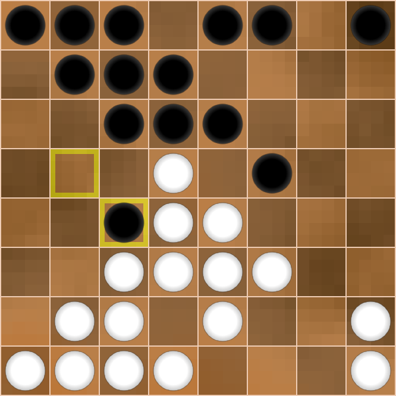
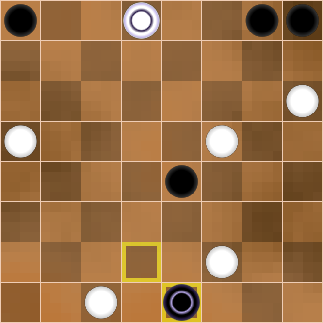

<link rel="stylesheet" type="text/css" href="styles.css">

# Diving Into Dameo
(This is a placeholder title. Edit away!)

This is an example of a specially styled paragraph.

## Introduction

Hello, dear reader!

This book is a sequel to the first book, ‘Meet Dameo!’ That time we got to know
the game, and now we are planning a deeper dive into it.

The idea of the second book is to show the beauty and inexhaustibility of this
game, the intentions and plans of the sides, and the originality of the players'
thinking through examples of whole games or long fragments of them. Consistency
in carrying out the plans of the players and a vivid battle of minds constitute
the beauty of any intellectual game.

It is very difficult to comment on Dameo games because of the huge number of
moves and variants. Only a computer program can handle such a massive amount,
but we are not going to complain and will try to study and understand this
little-explored game more deeply by means of ordinary human manual analysis.

We assume that the reader is already familiar with Dameo's rules, but we will
still briefly describe them. Sufficiently experienced players can skip this
description and proceed to the next chapter.

### Rules

So, the rules of Dameo are to a certain extent the same as the rules of
international draughts, but there are three major differences, namely:

> a) a simple checker moves forward in three directions; a king moves in 8
directions, like a queen in Chess to any available number of cells.

> b) a simple checker may jump over one or more other checkers of its own colour,
provided that the field ahead is free; the king does not participate in a line
jump (red arrows below on the diagram).

> c) all captures in Dameo are straight (orthogonal) only; a simple checker may
capture forward, backward, or sideways by the short leap; a king may capture by
the long leap.

All three differences are shown in diagrams 1a, 1b and 1c.

The rest of the rules (the rule of majority capture, the rule of Turkish strike)
coincide with the rules of international draughts.

1a {.diagram}

1b {.diagram}

1c {.diagram}

An important distinguishing feature of Dameo is the fact that two kings always
defeat a lone king. Due to this, you will win with even a small advantage. This
leads to a high percentage of decisive games compared to international draughts,
which tends to draw in high level play. The construction of the winning position
is shown in the first book in the chapter ‘Two kings against one’.

Well, that's the end of the introductory part and let's move on to the main
content.

## GAME №1  
Beginner_2017 vs Busybee
Tournament: draughts.cv.DAMEO.16.1.1  
2023

Games against player Busybee are always difficult but memorable. Busybee is probably the strongest Dameo player but he also has outstanding results in other games. For example, Busybee has a 100% win rate in such complex games as Shogi and Lines of Action. Of course, I would like to believe that he is a human and not a bot but unfortunately he hasn’t desire to start a dialogue or respond to a greeting. No problems, but it's a thousand pities. The point is that it is always nice to come across something unexplainable and genius, because it is an unforgettable experience for us ordinary people.

Our meeting had everything: a very complex opening, inventive play from both sides, nonobvious mistakes and nonobvious punishment for them, and a cascade of combination hits.

|     |        |        |
|-----|--------|--------|
|  1. | e3e4   | g8h7   |
|  2. | g1g3   | h7g6   |

{.diagram}

Black plays ingratiatingly and is not in a hurry. In fact, Busybee made the move g8g6 in two stages. In Chess, such a loss of time often leads to bad consequences in the opening, but Dameo allows you to regulate the pace of your development.

|     |        |        |
|-----|--------|--------|
|  3. | d2d4   |  g7g5  |
|  4. | e1e3   |  d8b6  |

{.diagram}

White also made the move e1e4 in two stages. I just decided to not rush either and see the opponent's intentions. White builds up its forces in the centre and isn't afraid of penetration by the opponent on the field h4:

|     |        |        |
|-----|--------|--------|
| 4.  | ...    | g5h4   |
| 5.  | d1g4   | h4:f4  |
| 6.  | f3:f5  | f6:f4  |
| 7.  | e4:g4  | ...    |

{.diagram}

White has a small advantage in development, as well as 6 pieces against 4 on its right flank. Take note that White removed the black checker f6 to avoid the exchange g6g5. In this case Black would have strengthened on the vertical ‘h’.  
All of the above doesn't mean that White has a clear advantage, just it would be clear and easy for me to play in such a position. Next, I would plan to accumulate forces on verticals ‘g’ and ‘h’, planning an attack and breakthrough on the right flank.  
Again I emphasise that Black's position is quite good, I just like to play with clear guidelines. In this case it is an attack by White's checkers on the right flank.  

Since Busybee refused this variant, I decided to take the h4 field myself.

|     |        |        |
|-----|--------|--------|
| 5.  | f2h4   | e6f5   |

{.diagram}

Possessing excellent combinational vision, Busybee often gives away the edge vertical, but constructs similar fists of checkers and sets endless traps.  
Now it is impossible to go to the field h5 due to the uncomplicated strike:

|     |        |        |
|-----|--------|--------|
| 6.  | h4h5?  | f5g4!  |
| 7.  | h5:f5  | f6:h2  |
| 8.  | g3:g7  | f7:h7  |
| 9.  | h1:h3  | ...    |

{.diagram}

Despite the material equality, White's position is worse due to the weakness of the right flank. Black's attack on the line ‘h’ is very dangerous.  

I decided not to hurry and first closed the field f2.

|     |        |        |
|-----|--------|--------|
| 6.  | f1f2   | e7e6   |

{.diagram}

The position escalates with each move.
Now, when White has already closed the hole f2, I really wanted to play 7.h4h5. Of course, Black has many answers, it's impossible to consider them all, but from a logical point of view there are two continuations.  
Let's consider each of them.

`А)`

|     |        |        |
|-----|--------|--------|
| 7.  | h4h5   | g5f4   |
| 8.  | e4:g4  | g6g5   |
| 9.  | g4:g6  | f6:h4  |

A splinter like that is hard to tolerate, so:  

|     |        |        |
|-----|--------|--------|
| 10. | g2h3   | h4:h2  |
| 11. | h1:h3  | ...    |

{.diagram}

During the game I saw this position in my mind and considered it as favourable for White. Why? I thought that I could continue the attack on the right flank by quickly moving forces there (d1g4, f2h4, e2h5). This plan is clear and understandable, so it's easier to play this way.  
But Black has a second continuation:

`B)`

|     |        |        |
|-----|--------|--------|
| 7.  | h4h5   | g6g4!? |

This answer leads to puzzling complications that are impossible for a human to figure out. Therefore, I didn't risk going for this continuation against a master of combination play like Busybee. What follows is possible:

|     |        |        |
|-----|--------|--------|
| 8.  | g3h4   | g5f4!? |

{.diagram}

In this position the variants are useless, because they are inexhaustible. I feared the binding of my centre by b8e5, and the march of my two pieces on the vertical ‘h’ is broken by the h8 piece. I didn't believe that I would get the king and be able to save it.  
So I decided to prepare more thoroughly an attack on the right extreme line (back to diagram 6).

{.diagram}

|     |        |        |
|-----|--------|--------|
| 7.  | g2h3   | f6e5   |

Black still binds White's centre, but in an unusual way. Obviously, Busybee provokes me, leaving a hole on the f6. But what did he come up with? 

|     |        |        |
|-----|--------|--------|
| 8.  | h3h5   | b6b5?! |

{.diagram}

What? B6b5?? I wasn't expecting this move at all. I would never have come up with it! Despite the sign ‘?!’, the move b6b5 is absolutely grandiose in its plan, but the problem is that I found an unexpected refutation. What is Black's plan against the h4h6 attack?   
Let's see!

|     |        |        |
|-----|--------|--------|
| 9.  | h4h6?  | f5g4!! |

The white checker moves to d5 directly under the bind. 

|     |        |        |
|-----|--------|--------|
| 10. | h5:d5  | g4:g2  |

Black knocks out the pillar of White's position - checker f2.

{.diagram}

Further there are possible insignificant permutations of moves, but we see that after 

|     |        |        |
|-----|--------|--------|
| 11. | h6:f6  | f7:f5  |
| 12. | f2:h2  | b5c4!  |

{.diagram}

Black undermines White's centre, gets material advantage and a won position.  
A crazy combination idea! 
I must confess that during the game I didn't see any of this, but just believed in my opponent.

Suddenly I saw that instead of a reckless attack I could counter-attack and the hunter would become the fowl!  
Let's go back to the diagram 9.

{.diagram}

In Black's position the dark squares are weakened, and it is possible to use this disadvantage with an oblique hit if there is a confrontation of squares in the centre. But where are the squares? If they are not there, we will create them! 

|     |        |        |
|-----|--------|--------|
| 9.  | f2c5!  | b5:d5  |
| 10. | e3c5!  | e5:e1  |
| 11. | c5:g7  | g6:g8  |
| 12. | d1:f1  | ...    |

{.diagram}

Despite the material equality White has an advantage, as Black is behind in development and has no counterplay. Busybee decides to simplify the position by exchanges.  

|     |        |        |
|-----|--------|--------|
| 12. | ...    |  f5f4  |
| 13. | f3:f5  | g5:e5  |

I didn't like the active centre piece e5, so I decided to exchange it.

|     |        |        |
|-----|--------|--------|
| 14. | b1e4   | e5:e3  |
| 15. | d3:f3  | c8e6   |

{.diagram}

I thought that the advantage in development and the twofold superiority in forces on the right flank would give me an excellent chance of victory. This is true, but White's position has one disadvantage: the pieces are still fragmented and, as a consequence, have little interaction. With this in mind, Busybee carries out a plan with a sharp build-up of forces in the centre to attack White's most vulnerable area between the flanks.

|     |        |        |
|-----|--------|--------|
| 16. | h1g2   | e8e7   |
| 17. | c2d3?! | ...    |

{.diagram}

Perhaps, this move loses all the advantage. White closes the hole d3, but opens the field c2, and Black instantly uses it. Better was 17.b2b3.

|     |        |        |
|-----|--------|--------|
| 17. | ...    | d7f5!  |

Now the field g5 is inaccessible for White.

|     |        |        |
|-----|--------|--------|
| 18. | g2g4   | b7d5!  |
| 19. | b2b3   |  ...   |

White finally closes its weak fields on the left flank, but Black makes a capture of the centre.

|     |        |        |
|-----|--------|--------|
| 19. | ...    | b8e5   |
| 20. | g3g5?  | ...    |

{.diagram}

White decided that it was time to take action after consolidating his forces. I convinced myself that neither e5f4 nor d6f4 is dangerous for me. In addition, c7f4 isn't valid, because at the end of the variant the g5 piece gets on the c7 square with two extra pieces.  

This is true, but the intention to outsmart Busybee in the combination game turned out to be too naive.

|     |        |        |
|-----|--------|--------|
| 20. | ...    | d5c4!! |

Busybee gets rid of his checker, which hinders Black in all variants.

|     |        |        |
|-----|--------|--------|
| 21. | d4:b4  | ...    |

What else to do? Another capture would lead to the loss of a checker and Black's powerful centre position. I won't catch a chance there.

|     |        |        |
|-----|--------|--------|
| 21. | ...    | c7f4   |

When there isn't a d5 piece, this strike is very strong.

|     |        |        |
|-----|--------|--------|
| 22. | g4:e4  | e5:g3  |
| 23. | g5:e5  | e6:e4  |

{.diagram}

Even though there are equal pieces on both sides, Black's position is won as Busybee can get 2 kings. One of them dies in the a1—c1 trap, but the other survives.  
This was clear enough to me, but only a few players know my character. In lost positions I often play the strongest.   
It's easy to play when everything on the board is good for you, but how hard it is to gather yourself at a critical moment and find a chain of the best moves with the faint hope for a draw! Perhaps my innate optimism helps me in this regard. Anyway, out of all the games I won, I had a very bad position in 30% of them.  
So, let's look at the diagram.   
Firstly, we need to prevent Black from getting 2 kings. To do this, we take control of the f3 square.

|     |        |        |
|-----|--------|--------|
| 24. | f1f2!  | g3h2   |
| 25. | c3a5   | ...    |

Secondly, we organise our own counter-play. It is necessary to constantly keep the opponent in suspense.

|     |        |        |
|-----|--------|--------|
| 25. | ...    | e7f6!  |

{.diagram}

Take note of Black's last move. This is a very multidimensional move. Checker f6 goes to help checker e4 to make a breakthrough on the field f3. But why didn't Black play d6e5 for this purpose? Then Busybee would save 1 tempo! But the d6 piece should go to c5 and close the c6 piece if White gets a king on c8. In this case White's king is caught by the way g8h7.  

Given this reasoning, I concluded that it is necessary to attack the black pieces on the last row to destroy the trap for the future king on c8.

|     |        |        |
|-----|--------|--------|
| 26. | h4h6!  | d6c5   |
| 27. | h5h7!  | ...    |

{.diagram}

White fights with all its might! Threatens h6g7, and at any capture White gets a king either on g8 or h8. In this case White's king will attack Black's checkers with tempo! What should Black do?  

The situation seems to be out of control, but Busybee finds a stunning manoeuvre with the sacrifice of 3 checkers! 

|     |        |        |
|-----|--------|--------|
| 27. | ...    | c6b5!! |
| 28. | b4:b6  | f8g7!! |
| 29. | h7:f5  |  h2g1  |

{.diagram}

Crazy position! White has 3 extra checkers and its turn to move, but the black king is stronger than the storm!  
What should White do?  

I realised immediately that it was bad for me:

|     |        |        |
|-----|--------|--------|
| 30. | c1b2 (c1c2) | g1f1! |

0:2.  
Black king from the rear attacks 2 checkers on vertical ‘f’ and then destroys everything in its path.

Doesn't help and loses immediately:

|     |        |        |
|-----|--------|--------|
| 30. | f5e6   | g1:b7  |

0:2, as the black king controls the 7th horizontal, preventing any breakthrough.

For this reason, it's no good:

|     |        |        |
|-----|--------|--------|
| 30. | b3a4   | g1:b7  |
| 31. | a4a6   | b7a7   |

0:2.

A counterpunch for the majority doesn’t help either:

|     |        |        |
|-----|--------|--------|
| 30. | c1d2   | g1f1!  |
| 31. | d2e3   | ...    |

{.diagram}

Original and beautiful, but no more.

|     |        |        |
|-----|--------|--------|
| 31. | ...    | f1:c3  |
| 32. | d3:b3  | e4:e2  |

0:2.

Let's go back to the main line diagram 19.

{.diagram}

Being in a desperate situation, White finds the best move.

|     |        |        |
|-----|--------|--------|
| 30. | b3c4!  | ...    |

A sign of ‘!’ for persistence and ingenuity even in this position.

Now, in the case of an erroneous

|     |        |        |
|-----|--------|--------|
| 30. | ...    | c5:e3??|
| 31. | b6c7   | g1:b1  |
| 32. | a1:c1  | e3d2   |
| 33. | c7d8   | d2e1   |

{.diagram}

There are two paths to White's victory here:  

`A)`

|     |        |        |
|-----|--------|--------|
| 34. | h6h7   | e1:a7  |
| 35. | d8e8   | h8:h6  |
| 36. | d8:d4  | ...    |

Then the white king penetrates the h7 square and helps to get the second king, 2:0;

`B)`

|     |        |        |
|-----|--------|--------|
| 34. | f5f6   | e1:g6  |
| 35. | h6:f6  | ...    |

Then White gets a second king and gradually destroys all black pieces, 2:0.  
What a turnaround!

But Busybee takes the king out of the danger zone:

|     |        |        |
|-----|--------|--------|
| 30. | ...    | g1:b7! |
| 31. | c4:c6  | ...    |

{.diagram}

It seems White has some chance of salvation, as it is eventually possible to distract the black king with the sacrifice of a couple of checkers, but look what Busybee has come up with!

|     |        |        |
|-----|--------|--------|
| 31. | ...    | e4f3!! |

Who would think of such a move? Fantastic!

|     |        |        |
|-----|--------|--------|
| 32. | f2:f4  | b7h7!  |

{.diagram}

A rare and beautiful fork. White again has 3 extra pieces, but the position clearly shows the power of the king in Dameo.

|     |        |        |
|-----|--------|--------|
| 33. | d3e4   | ...    |

There's nothing better.

|     |        |        |
|-----|--------|--------|
| 33. | ...    | h7:c7  |

{.diagram}

Black king not only controls the 7th horizontal, but also threatens to win the checker a5 by direct attack from the fields a7, b8, c8, but even now White sets the last trap!

|     |        |        |
|-----|--------|--------|
| 34. | a1b2!  | ...    |

Fortunately, ingenuity didn't leave me and I found the strongest move. 

Now, in the event of a direct attack:

|     |        |        |
|-----|--------|--------|
| 34. | ...    | c7a7?  |
| 35. | a5b6   | a7b8   |
| 36. | b6c7   | ...    |

Black is forced to capture the checker b2, and White gets a king:  

|     |        |        |
|-----|--------|--------|
| 36. | ...    | b8:b1  |
| 37. | c7d8   | ...    |

The fight goes on for a long time, and White's chances increase. 

But Busybee found the right rearrangement of his checkers.

|     |        |        |
|-----|--------|--------|
| 34. | ...    | c7b8!  |
| 35. | b2a3   | a8b7!  |

{.diagram}

Black prepared the sacrifice b7a6 followed by b8a8. White has no defence against it.

|     |        |        |
|-----|--------|--------|
| 36. | a3a4   | b7a6   |
| 37. | a5:a7  | b8a8   |

{.diagram}

White gave up.  
0:2.

Well... Despite losing, I really enjoyed fighting in this game. After all, beauty is above all, and I'm glad that I created it with my partner. 
